# Module dependency diagrams

This page contains a series of diagrams to illustrate the dependency relationships between the
modules this project is made up of.

Modules with only incoming arrows (e.g. `:resources`) and which do not depend on anything internal
to the project are not listed.

## Top-level modules

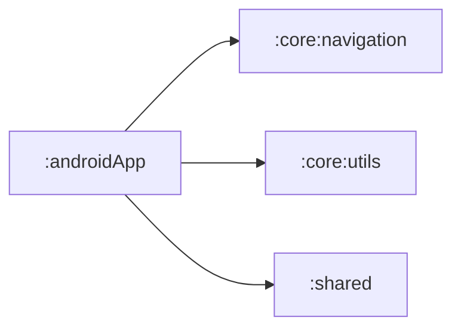

```mermaid
flowchart LR
    :shared --> :core:api
    :shared --> :core:appearance
    :shared --> :core:architecture
    :shared --> :core:commonui:detailopenerApi
    :shared --> :core:commonui:detailopenerImpl
    :shared --> :core:commonui:lemmyui
    :shared --> :core:md
    :shared --> :core:navigation
    :shared --> :core:notifications
    :shared --> :core:persistence
    :shared --> :core:preferences
    :shared --> :core:utils
    :shared --> :domain:identity
    :shared --> :domain:inbox
    :shared --> :domain:lemmy:data
    :shared --> :domain:lemmy:repository
    :shared --> :unit:accountsettings
    :shared --> :unit:ban
    :shared --> :unit:chat
    :shared --> :unit:communitydetail
    :shared --> :unit:communityinfo
    :shared --> :unit:createcomment
    :shared --> :unit:createpost
    :shared --> :unit:createreport
    :shared --> :unit:drawer
    :shared --> :unit:instanceinfo
    :shared --> :unit:manageban
    :shared --> :unit:managesubscriptions
    :shared --> :unit:modlog
    :shared --> :unit:multicommunity
    :shared --> :unit:postdetail
    :shared --> :unit:remove
    :shared --> :unit:reportlist
    :shared --> :unit:saveditems
    :shared --> :unit:selectcommunity
    :shared --> :unit:selectinstance
    :shared --> :unit:userdetail
    :shared --> :unit:userinfo
    :shared --> :unit:zoomableimage
    :shared --> :feature:home
    :shared --> :feature:inbox
    :shared --> :feature:profile
    :shared --> :feature:search
    :shared --> :feature:settings
    :shared --> :resources
```

## Feature modules

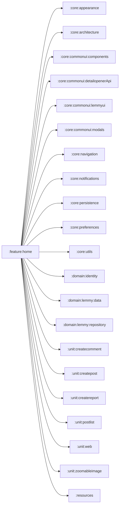

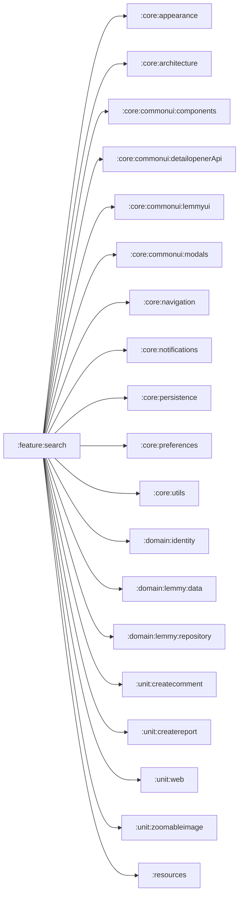

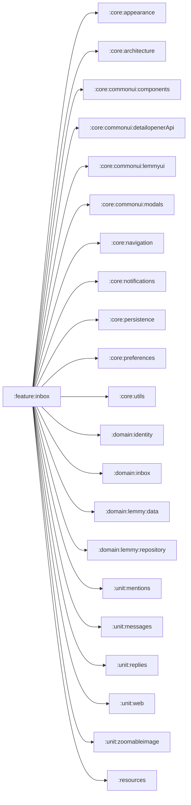

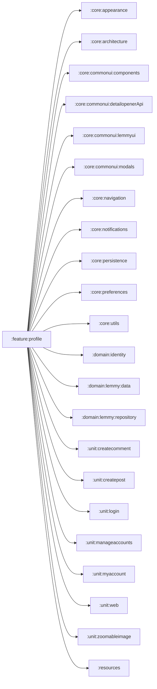

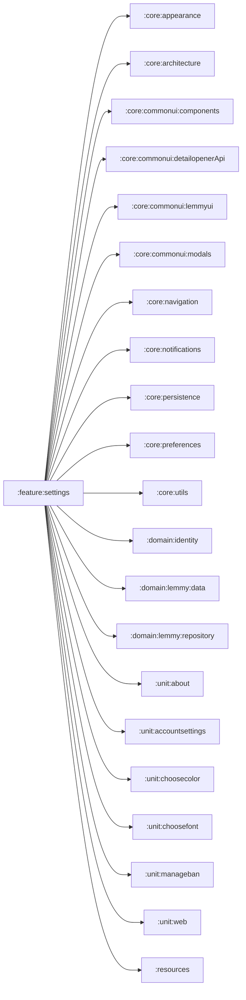

## Domain modules

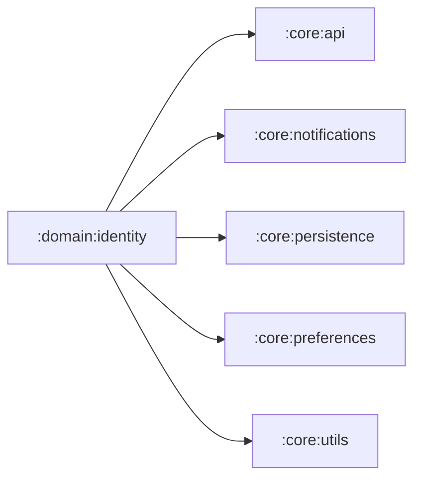

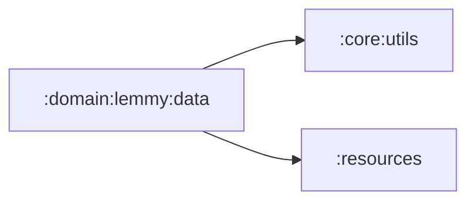

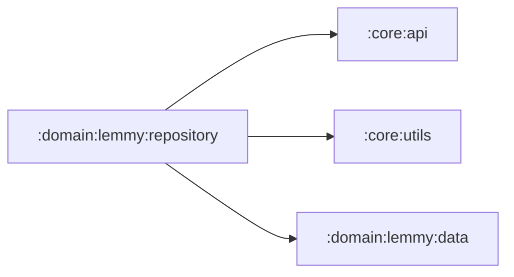

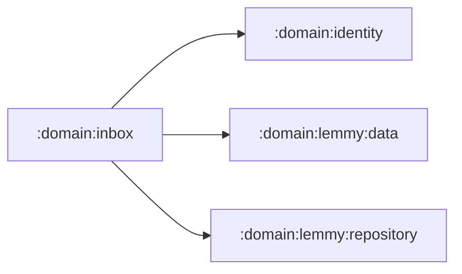

## Unit modules

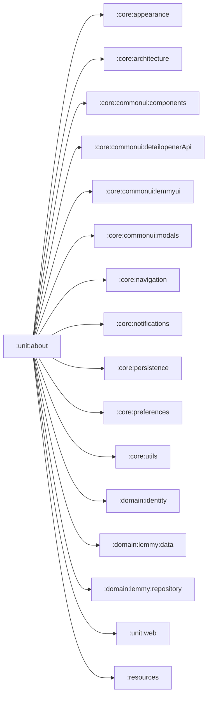

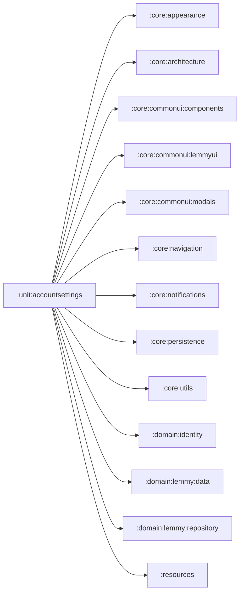

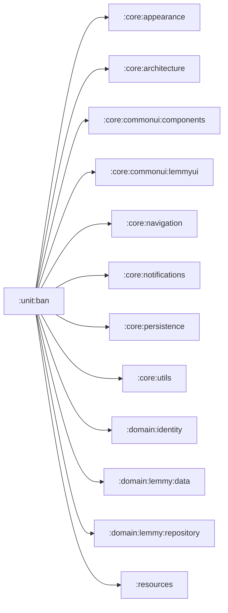

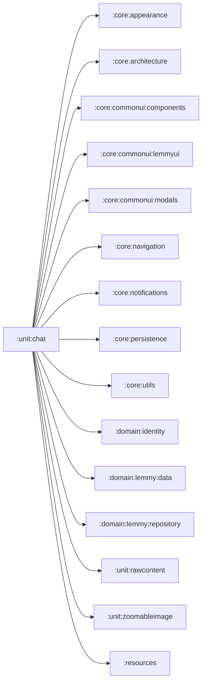

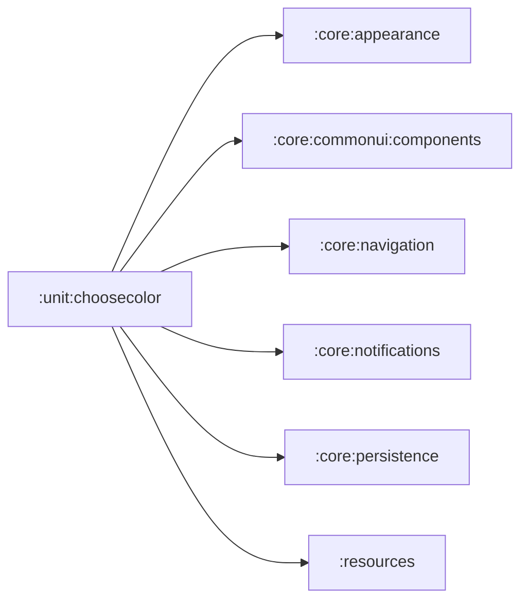

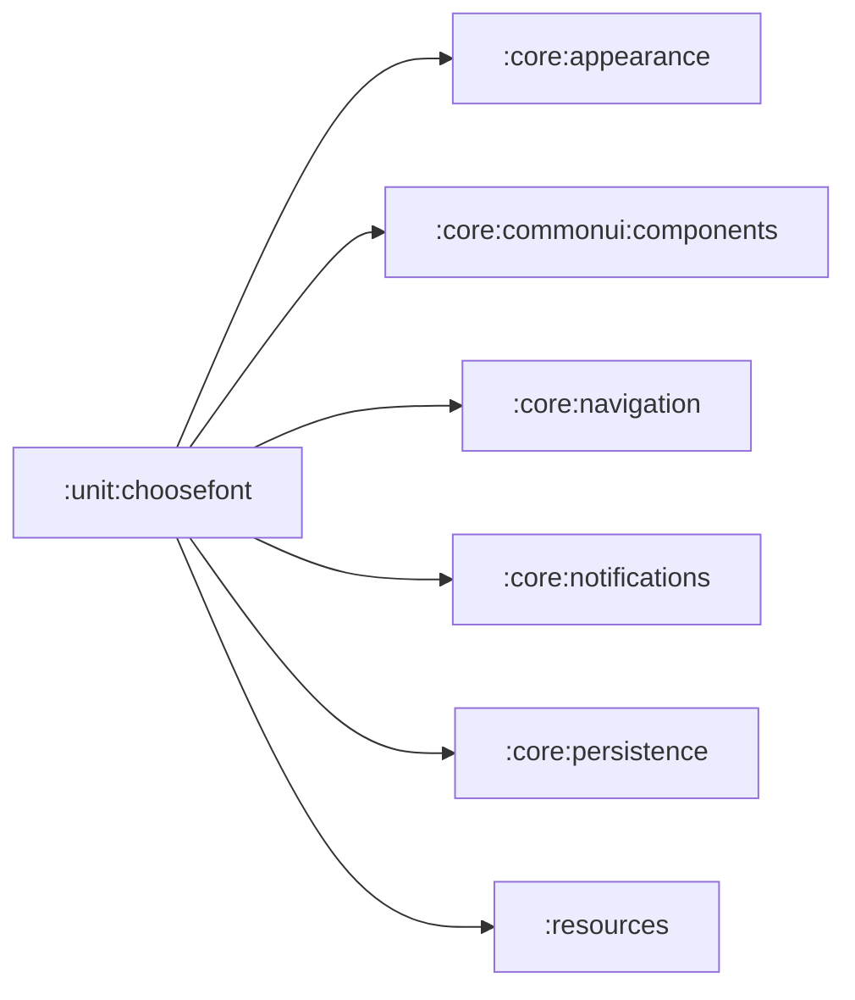

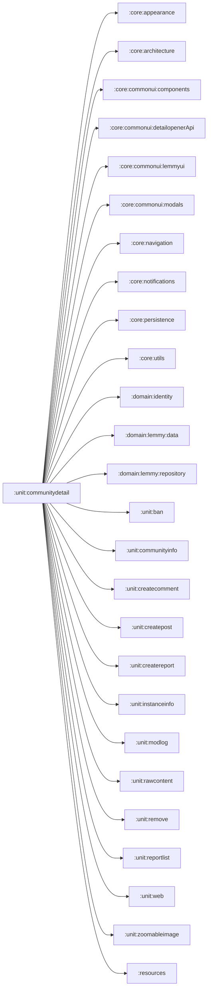

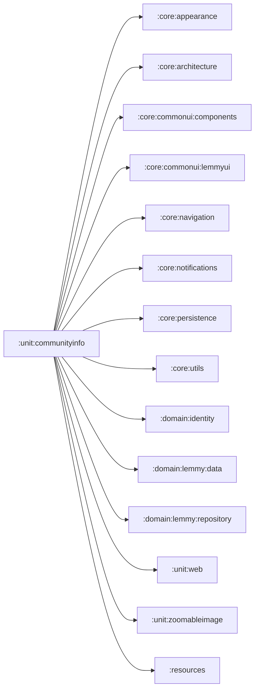

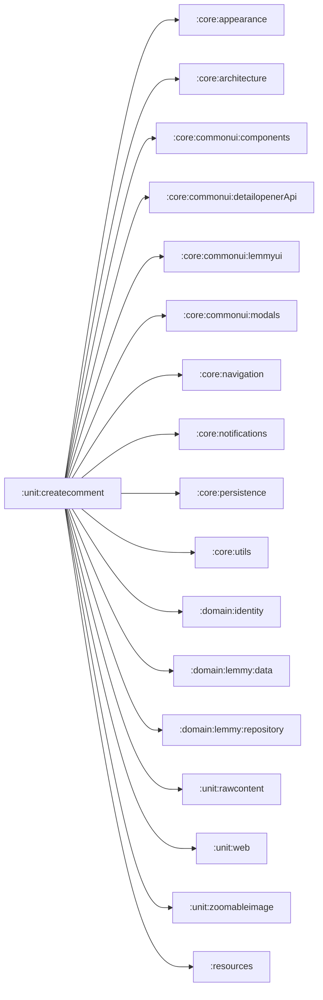

```mermaid
flowchart LR
    :unit:createpost --> :core:appearance
    :unit:createpost --> :core:architecture
    :unit:createpost --> :core:commonui:components
    :unit:createpost --> :core:commonui:detailopenerApi
    :unit:createpost --> :core:commonui:lemmyui
    :unit:createpost --> :core:commonui:modals
    :unit:createpost --> :core:navigation
    :unit:createpost --> :core:notifications
    :unit:createpost --> :core:persistence
    :unit:createpost --> :core:utils
    :unit:createpost --> :domain:identity
    :unit:createpost --> :domain:lemmy:data
    :unit:createpost --> :domain:lemmy:repository
    :unit:createpost --> :unit:rawcontent
    :unit:createpost --> :unit:selectcommunity
    :unit:createpost --> :unit:web
    :unit:createpost --> :unit:zoomableimage
    :unit:createpost --> :resources
```

```mermaid
flowchart LR
    :unit:createreport --> :core:appearance
    :unit:createreport --> :core:architecture
    :unit:createreport --> :core:commonui:components
    :unit:createreport --> :core:commonui:detailopenerApi
    :unit:createreport --> :core:commonui:lemmyui
    :unit:createreport --> :core:commonui:modals
    :unit:createreport --> :core:navigation
    :unit:createreport --> :core:notifications
    :unit:createreport --> :core:persistence
    :unit:createreport --> :core:utils
    :unit:createreport --> :domain:identity
    :unit:createreport --> :domain:lemmy:data
    :unit:createreport --> :domain:lemmy:repository
    :unit:createreport --> :unit:web
    :unit:createreport --> :unit:zoomableimage
    :unit:createreport --> :resources
```

```mermaid
flowchart LR
    :unit:drawer --> :core:appearance
    :unit:drawer --> :core:architecture
    :unit:drawer --> :core:commonui:components
    :unit:drawer --> :core:commonui:lemmyui
    :unit:drawer --> :core:navigation
    :unit:drawer --> :core:notifications
    :unit:drawer --> :core:persistence
    :unit:drawer --> :core:utils
    :unit:drawer --> :domain:identity
    :unit:drawer --> :domain:lemmy:data
    :unit:drawer --> :domain:lemmy:repository
    :unit:drawer --> :unit:selectinstanace
    :unit:drawer --> :resources
```

```mermaid
flowchart LR
    :unit:instanceinfo --> :core:appearance
    :unit:instanceinfo --> :core:architecture
    :unit:instanceinfo --> :core:commonui:components
    :unit:instanceinfo --> :core:commonui:detailopenerApi
    :unit:instanceinfo --> :core:commonui:lemmyui
    :unit:instanceinfo --> :core:navigation
    :unit:instanceinfo --> :core:notifications
    :unit:instanceinfo --> :core:persistence
    :unit:instanceinfo --> :core:utils
    :unit:instanceinfo --> :domain:identity
    :unit:instanceinfo --> :domain:lemmy:data
    :unit:instanceinfo --> :domain:lemmy:repository
    :unit:instanceinfo --> :unit:web
    :unit:instanceinfo --> :unit:zoomableimage
    :unit:instanceinfo --> :resources
```

```mermaid
flowchart LR
    :unit:login --> :core:appearance
    :unit:login --> :core:architecture
    :unit:login --> :core:commonui:components
    :unit:login --> :core:commonui:lemmyui
    :unit:login --> :core:navigation
    :unit:login --> :core:notifications
    :unit:login --> :core:persistence
    :unit:login --> :core:utils
    :unit:login --> :domain:identity
    :unit:login --> :domain:lemmy:data
    :unit:login --> :domain:lemmy:repository
    :unit:login --> :unit:web
    :unit:login --> :resources
```

```mermaid
flowchart LR
    :unit:manageaccounts --> :core:appearance
    :unit:manageaccounts --> :core:architecture
    :unit:manageaccounts --> :core:commonui:components
    :unit:manageaccounts --> :core:commonui:lemmyui
    :unit:manageaccounts --> :core:navigation
    :unit:manageaccounts --> :core:notifications
    :unit:manageaccounts --> :core:persistence
    :unit:manageaccounts --> :core:utils
    :unit:manageaccounts --> :domain:identity
    :unit:manageaccounts --> :domain:lemmy:data
    :unit:manageaccounts --> :domain:lemmy:repository
    :unit:manageaccounts --> :unit:login
    :unit:manageaccounts --> :unit:web
    :unit:manageaccounts --> :resources
```

```mermaid
flowchart LR
    :unit:manageban --> :core:appearance
    :unit:manageban --> :core:architecture
    :unit:manageban --> :core:commonui:components
    :unit:manageban --> :core:commonui:lemmyui
    :unit:manageban --> :core:navigation
    :unit:manageban --> :core:notifications
    :unit:manageban --> :core:persistence
    :unit:manageban --> :core:utils
    :unit:manageban --> :domain:identity
    :unit:manageban --> :domain:lemmy:data
    :unit:manageban --> :domain:lemmy:repository
    :unit:manageban --> :resources
```

```mermaid
flowchart LR
    :unit:managesubscriptions --> :core:appearance
    :unit:managesubscriptions --> :core:architecture
    :unit:managesubscriptions --> :core:commonui:components
    :unit:managesubscriptions --> :core:commonui:detailopenerApi
    :unit:managesubscriptions --> :core:commonui:lemmyui
    :unit:managesubscriptions --> :core:navigation
    :unit:managesubscriptions --> :core:notifications
    :unit:managesubscriptions --> :core:persistence
    :unit:managesubscriptions --> :core:utils
    :unit:managesubscriptions --> :domain:identity
    :unit:managesubscriptions --> :domain:lemmy:data
    :unit:managesubscriptions --> :domain:lemmy:repository
    :unit:managesubscriptions --> :resources
```

```mermaid
flowchart LR
    :unit:mentions --> :core:appearance
    :unit:mentions --> :core:architecture
    :unit:mentions --> :core:commonui:components
    :unit:mentions --> :core:commonui:detailopenerApi
    :unit:mentions --> :core:commonui:lemmyui
    :unit:mentions --> :core:navigation
    :unit:mentions --> :core:notifications
    :unit:mentions --> :core:persistence
    :unit:mentions --> :core:utils
    :unit:mentions --> :domain:identity
    :unit:mentions --> :domain:inbox
    :unit:mentions --> :domain:lemmy:data
    :unit:mentions --> :domain:lemmy:repository
    :unit:mentions --> :unit:zoomableimage
    :unit:mentions --> :resources
```

```mermaid
flowchart LR
    :unit:messages --> :core:appearance
    :unit:messages --> :core:architecture
    :unit:messages --> :core:commonui:components
    :unit:messages --> :core:commonui:detailopenerApi
    :unit:messages --> :core:commonui:lemmyui
    :unit:messages --> :core:navigation
    :unit:messages --> :core:notifications
    :unit:messages --> :core:persistence
    :unit:messages --> :core:utils
    :unit:messages --> :domain:identity
    :unit:messages --> :domain:inbox
    :unit:messages --> :domain:lemmy:data
    :unit:messages --> :domain:lemmy:repository
    :unit:messages --> :unit:chat
    :unit:messages --> :unit:zoomableimage
    :unit:messages --> :resources
```

```mermaid
flowchart LR
    :unit:modlog --> :core:appearance
    :unit:modlog --> :core:architecture
    :unit:modlog --> :core:commonui:components
    :unit:modlog --> :core:commonui:detailopenerApi
    :unit:modlog --> :core:commonui:lemmyui
    :unit:modlog --> :core:navigation
    :unit:modlog --> :core:notifications
    :unit:modlog --> :core:persistence
    :unit:modlog --> :core:utils
    :unit:modlog --> :domain:identity
    :unit:modlog --> :domain:lemmy:data
    :unit:modlog --> :domain:lemmy:repository
    :unit:modlog --> :resources
```

```mermaid
flowchart LR
    :unit:multicommunity --> :core:appearance
    :unit:multicommunity --> :core:architecture
    :unit:multicommunity --> :core:commonui:components
    :unit:multicommunity --> :core:commonui:detailopenerApi
    :unit:multicommunity --> :core:commonui:lemmyui
    :unit:multicommunity --> :core:commonui:modals
    :unit:multicommunity --> :core:navigation
    :unit:multicommunity --> :core:notifications
    :unit:multicommunity --> :core:persistence
    :unit:multicommunity --> :core:utils
    :unit:multicommunity --> :domain:identity
    :unit:multicommunity --> :domain:lemmy:data
    :unit:multicommunity --> :domain:lemmy:repository
    :unit:multicommunity --> :unit:ban
    :unit:multicommunity --> :unit:communityinfo
    :unit:multicommunity --> :unit:createcomment
    :unit:multicommunity --> :unit:createpost
    :unit:multicommunity --> :unit:createreport
    :unit:multicommunity --> :unit:remove
    :unit:multicommunity --> :unit:reportlist
    :unit:multicommunity --> :unit:web
    :unit:multicommunity --> :unit:zoomableimage
    :unit:multicommunity --> :resources
```

```mermaid
flowchart LR
    :unit:myaccount --> :core:appearance
    :unit:myaccount --> :core:architecture
    :unit:myaccount --> :core:commonui:components
    :unit:myaccount --> :core:commonui:detailopenerApi
    :unit:myaccount --> :core:commonui:lemmyui
    :unit:myaccount --> :core:commonui:modals
    :unit:myaccount --> :core:navigation
    :unit:myaccount --> :core:notifications
    :unit:myaccount --> :core:persistence
    :unit:myaccount --> :core:utils
    :unit:myaccount --> :domain:identity
    :unit:myaccount --> :domain:lemmy:data
    :unit:myaccount --> :domain:lemmy:repository
    :unit:myaccount --> :unit:ban
    :unit:myaccount --> :unit:chat
    :unit:myaccount --> :unit:createcomment
    :unit:myaccount --> :unit:createpost
    :unit:myaccount --> :unit:createreport
    :unit:myaccount --> :unit:remove
    :unit:myaccount --> :unit:web
    :unit:myaccount --> :unit:zoomableimage
    :unit:myaccount --> :resources
```

```mermaid
flowchart LR
    :unit:postdetail --> :core:appearance
    :unit:postdetail --> :core:architecture
    :unit:postdetail --> :core:commonui:components
    :unit:postdetail --> :core:commonui:detailopenerApi
    :unit:postdetail --> :core:commonui:lemmyui
    :unit:postdetail --> :core:commonui:modals
    :unit:postdetail --> :core:navigation
    :unit:postdetail --> :core:notifications
    :unit:postdetail --> :core:persistence
    :unit:postdetail --> :core:utils
    :unit:postdetail --> :domain:identity
    :unit:postdetail --> :domain:lemmy:data
    :unit:postdetail --> :domain:lemmy:repository
    :unit:postdetail --> :unit:ban
    :unit:postdetail --> :unit:createcomment
    :unit:postdetail --> :unit:createreport
    :unit:postdetail --> :unit:rawcontent
    :unit:postdetail --> :unit:remove
    :unit:postdetail --> :unit:web
    :unit:postdetail --> :unit:zoomableimage
    :unit:postdetail --> :resources
```

```mermaid
flowchart LR
    :unit:postlist --> :core:appearance
    :unit:postlist --> :core:architecture
    :unit:postlist --> :core:commonui:components
    :unit:postlist --> :core:commonui:detailopenerApi
    :unit:postlist --> :core:commonui:lemmyui
    :unit:postlist --> :core:commonui:modals
    :unit:postlist --> :core:navigation
    :unit:postlist --> :core:notifications
    :unit:postlist --> :core:persistence
    :unit:postlist --> :core:utils
    :unit:postlist --> :domain:identity
    :unit:postlist --> :domain:lemmy:data
    :unit:postlist --> :domain:lemmy:repository
    :unit:postlist --> :unit:ban
    :unit:postlist --> :unit:communityinfo
    :unit:postlist --> :unit:createcomment
    :unit:postlist --> :unit:createpost
    :unit:postlist --> :unit:createreport
    :unit:postlist --> :unit:instanceinfo
    :unit:postlist --> :unit:rawcontent
    :unit:postlist --> :unit:remove
    :unit:postlist --> :unit:reportlist
    :unit:postlist --> :unit:selectinstance
    :unit:postlist --> :unit:web
    :unit:postlist --> :unit:zoomableimage
    :unit:postlist --> :resources
```

```mermaid
flowchart LR
    :unit:rawcontent --> :core:appearance
    :unit:rawcontent --> :core:utils
    :unit:rawcontent --> :resources
```

```mermaid
flowchart LR
    :unit:remove --> :core:appearance
    :unit:remove --> :core:architecture
    :unit:remove --> :core:commonui:components
    :unit:remove --> :core:commonui:detailopenerApi
    :unit:remove --> :core:commonui:lemmyui
    :unit:remove --> :core:commonui:modals
    :unit:remove --> :core:navigation
    :unit:remove --> :core:notifications
    :unit:remove --> :core:persistence
    :unit:remove --> :core:utils
    :unit:remove --> :domain:identity
    :unit:remove --> :domain:lemmy:data
    :unit:remove --> :domain:lemmy:repository
    :unit:remove --> :unit:web
    :unit:remove --> :unit:zoomableimage
    :unit:remove --> :resources
```

```mermaid
flowchart LR
    :unit:replies --> :core:appearance
    :unit:replies --> :core:architecture
    :unit:replies --> :core:commonui:components
    :unit:replies --> :core:commonui:detailopenerApi
    :unit:replies --> :core:commonui:lemmyui
    :unit:replies --> :core:commonui:modals
    :unit:replies --> :core:navigation
    :unit:replies --> :core:notifications
    :unit:replies --> :core:persistence
    :unit:replies --> :core:utils
    :unit:replies --> :domain:identity
    :unit:replies --> :domain:inbox
    :unit:replies --> :domain:lemmy:data
    :unit:replies --> :domain:lemmy:repository
    :unit:replies --> :unit:zoomableimage
    :unit:replies --> :resources
```

```mermaid
flowchart LR
    :unit:reportlist --> :core:appearance
    :unit:reportlist --> :core:architecture
    :unit:reportlist --> :core:commonui:components
    :unit:reportlist --> :core:commonui:detailopenerApi
    :unit:reportlist --> :core:commonui:lemmyui
    :unit:reportlist --> :core:commonui:modals
    :unit:reportlist --> :core:navigation
    :unit:reportlist --> :core:notifications
    :unit:reportlist --> :core:persistence
    :unit:reportlist --> :core:utils
    :unit:reportlist --> :domain:identity
    :unit:reportlist --> :domain:lemmy:data
    :unit:reportlist --> :domain:lemmy:repository
    :unit:reportlist --> :unit:rawcontent
    :unit:reportlist --> :unit:web
    :unit:reportlist --> :unit:zoomableimage
    :unit:reportlist --> :resources
```

```mermaid
flowchart LR
    :unit:saveditems --> :core:appearance
    :unit:saveditems --> :core:architecture
    :unit:saveditems --> :core:commonui:components
    :unit:saveditems --> :core:commonui:detailopenerApi
    :unit:saveditems --> :core:commonui:lemmyui
    :unit:saveditems --> :core:commonui:modals
    :unit:saveditems --> :core:navigation
    :unit:saveditems --> :core:notifications
    :unit:saveditems --> :core:persistence
    :unit:saveditems --> :core:utils
    :unit:saveditems --> :domain:identity
    :unit:saveditems --> :domain:lemmy:data
    :unit:saveditems --> :domain:lemmy:repository
    :unit:saveditems --> :unit:createcomment
    :unit:saveditems --> :unit:createreport
    :unit:saveditems --> :unit:rawcontent
    :unit:saveditems --> :unit:web
    :unit:saveditems --> :unit:zoomableimage
    :unit:saveditems --> :resources
```

```mermaid
flowchart LR
    :unit:selectcommunity --> :core:appearance
    :unit:selectcommunity --> :core:architecture
    :unit:selectcommunity --> :core:commonui:components
    :unit:selectcommunity --> :core:commonui:lemmyui
    :unit:selectcommunity --> :core:navigation
    :unit:selectcommunity --> :core:notifications
    :unit:selectcommunity --> :core:persistence
    :unit:selectcommunity --> :core:utils
    :unit:selectcommunity --> :domain:identity
    :unit:selectcommunity --> :domain:lemmy:data
    :unit:selectcommunity --> :domain:lemmy:repository
    :unit:selectcommunity --> :resources
```

```mermaid
flowchart LR
    :unit:selectintance --> :core:appearance
    :unit:selectintance --> :core:architecture
    :unit:selectintance --> :core:commonui:components
    :unit:selectintance --> :core:commonui:lemmyui
    :unit:selectintance --> :core:navigation
    :unit:selectintance --> :core:notifications
    :unit:selectintance --> :core:persistence
    :unit:selectintance --> :core:utils
    :unit:selectintance --> :domain:identity
    :unit:selectintance --> :domain:lemmy:data
    :unit:selectintance --> :domain:lemmy:repository
    :unit:selectintance --> :resources
```

```mermaid
flowchart LR
    :unit:userdetail --> :core:appearance
    :unit:userdetail --> :core:architecture
    :unit:userdetail --> :core:commonui:components
    :unit:userdetail --> :core:commonui:detailopenerApi
    :unit:userdetail --> :core:commonui:lemmyui
    :unit:userdetail --> :core:commonui:modals
    :unit:userdetail --> :core:navigation
    :unit:userdetail --> :core:notifications
    :unit:userdetail --> :core:persistence
    :unit:userdetail --> :core:utils
    :unit:userdetail --> :domain:identity
    :unit:userdetail --> :domain:lemmy:data
    :unit:userdetail --> :domain:lemmy:repository
    :unit:userdetail --> :unit:ban
    :unit:userdetail --> :unit:chat
    :unit:userdetail --> :unit:createcomment
    :unit:userdetail --> :unit:createpost
    :unit:userdetail --> :unit:createreport
    :unit:userdetail --> :unit:remove
    :unit:userdetail --> :unit:rawcontent
    :unit:userdetail --> :unit:userinfo
    :unit:userdetail --> :unit:web
    :unit:userdetail --> :unit:zoomableimage
    :unit:userdetail --> :resources
```

```mermaid
flowchart LR
    :unit:userinfo --> :core:appearance
    :unit:userinfo --> :core:architecture
    :unit:userinfo --> :core:commonui:components
    :unit:userinfo --> :core:commonui:detailopenerApi
    :unit:userinfo --> :core:commonui:lemmyui
    :unit:userinfo --> :core:commonui:modals
    :unit:userinfo --> :core:navigation
    :unit:userinfo --> :core:notifications
    :unit:userinfo --> :core:persistence
    :unit:userinfo --> :domain:identity
    :unit:userinfo --> :domain:lemmy:data
    :unit:userinfo --> :domain:lemmy:repository
    :unit:userinfo --> :unit:web
    :unit:userinfo --> :unit:zoomableimage
    :unit:userinfo --> :resources
```

```mermaid
flowchart LR
    :unit:web --> :core:appearance
    :unit:web --> :core:commonui:components
    :unit:web --> :core:navigation
    :unit:web --> :core:utils
    :unit:web --> :resources
```

```mermaid
flowchart LR
    :unit:zoomableimage --> :core:appearance
    :unit:zoomableimage --> :core:architecture
    :unit:zoomableimage --> :core:commonui:components
    :unit:zoomableimage --> :core:commonui:lemmyui
    :unit:zoomableimage --> :core:navigation
    :unit:zoomableimage --> :core:notifications
    :unit:zoomableimage --> :core:persistence
    :unit:zoomableimage --> :core:utils
    :unit:zoomableimage --> :resources
```

## Core modules

```mermaid
flowchart LR
    :core:api --> :core:utils
```

```mermaid
flowchart LR
    :core:appearance --> :resources
```

```mermaid
flowchart LR
    :core:commonui:components --> :core:appearance
    :core:commonui:components --> :core:utils
    :core:commonui:components --> :resources
```

```mermaid
flowchart LR
    :core:commonui:detailopenerApi --> :domain:lemmy:data
    :core:commonui:detailopenerApi --> :resources
```

```mermaid
flowchart LR
    :core:commonui:detailopenerImpl --> :core:commonui:detailopenerApi
    :core:commonui:detailopenerImpl --> :core:navigation
    :core:commonui:detailopenerImpl --> :domain:lemmy:data
    :core:commonui:detailopenerImpl --> :domain:lemmy:repository
    :core:commonui:detailopenerImpl --> :unit:communitydetail
    :core:commonui:detailopenerImpl --> :unit:createcommnet
    :core:commonui:detailopenerImpl --> :unit:createpost
    :core:commonui:detailopenerImpl --> :unit:postdetail
    :core:commonui:detailopenerImpl --> :unit:userdetail
    :core:commonui:detailopenerImpl --> :resources
```

```mermaid
flowchart LR
    :core:commonui:lemmyui --> :core:appearance
    :core:commonui:lemmyui --> :core:commonui:components
    :core:commonui:lemmyui --> :core:md
    :core:commonui:lemmyui --> :core:navigation
    :core:commonui:lemmyui --> :core:persistence
    :core:commonui:lemmyui --> :core:utils
    :core:commonui:lemmyui --> :domain:lemmy:data
    :core:commonui:lemmyui --> :resources
```

```mermaid
flowchart LR
    :core:commonui:modals --> :core:appearance
    :core:commonui:modals --> :core:commonui:components
    :core:commonui:modals --> :core:commonui:lemmyui
    :core:commonui:modals --> :core:navigation
    :core:commonui:modals --> :core:notifications
    :core:commonui:modals --> :core:persistence
    :core:commonui:modals --> :core:utils
    :core:commonui:modals --> :domain:lemmy:data
    :core:commonui:modals --> :resources
```

```mermaid
flowchart LR
    :core:md --> :core:commonui:components
    :core:md --> :core:utils
    :core:md --> :resources
```

```mermaid
flowchart LR
    :core:navigation --> :core:persistence
    :core:navigation --> :domain:lemmy:data
    :core:navigation --> :resources
```

```mermaid
flowchart LR
    :core:notifications --> :core:appearance
    :core:notifications --> :core:persistence
    :core:notifications --> :domain:lemmy:data
    :core:notifications --> :resources
```

```mermaid
flowchart LR
    :core:persistence --> :core:appearance
    :core:persistence --> :core:preferences
    :core:persistence --> :core:utils
```

```mermaid
flowchart LR
    :core:utils --> :resources
```
