## Top-level modules

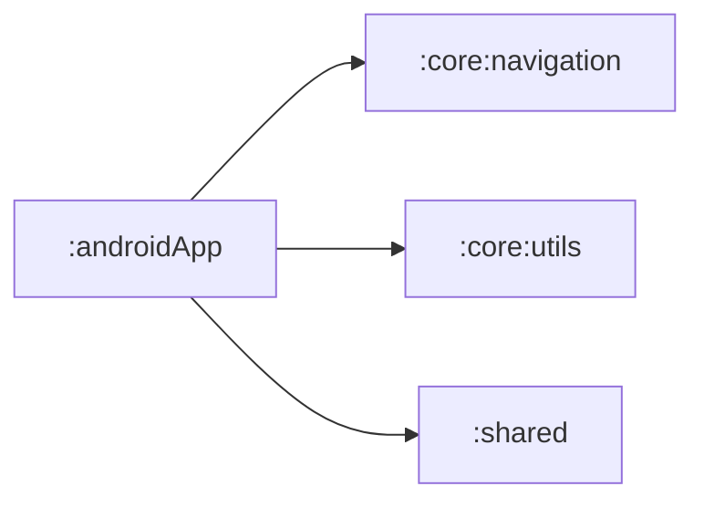
```mermaid
flowchart LR
    :androidApp --> :core:navigation
    :androidApp --> :core:utils
    :androidApp --> :shared
```

```mermaid
flowchart LR
    :shared --> :core:api
    :shared --> :core:appearance
    :shared --> :core:architecture
    :shared --> :core:commonui:detailopenerApi
    :shared --> :core:commonui:detailopenerImpl
    :shared --> :core:commonui:lemmyui
    :shared --> :core:md
    :shared --> :core:navigation
    :shared --> :core:notifications
    :shared --> :core:persistence
    :shared --> :core:preferences
    :shared --> :core:utils
    :shared --> :domain:identity
    :shared --> :domain:inbox
    :shared --> :domain:lemmy:data
    :shared --> :domain:lemmy:repository
    :shared --> :unit:accountsettings
    :shared --> :unit:ban
    :shared --> :unit:chat
    :shared --> :unit:communitydetail
    :shared --> :unit:communityinfo
    :shared --> :unit:createcomment
    :shared --> :unit:createpost
    :shared --> :unit:createreport
    :shared --> :unit:drawer
    :shared --> :unit:instanceinfo
    :shared --> :unit:manageban
    :shared --> :unit:managesubscriptions
    :shared --> :unit:modlog
    :shared --> :unit:multicommunity
    :shared --> :unit:postdetail
    :shared --> :unit:remove
    :shared --> :unit:reportlist
    :shared --> :unit:saveditems
    :shared --> :unit:selectcommunity
    :shared --> :unit:selectinstance
    :shared --> :unit:userdetail
    :shared --> :unit:userinfo
    :shared --> :unit:zoomableimage
    :shared --> :feature:home
    :shared --> :feature:inbox
    :shared --> :feature:profile
    :shared --> :feature:search
    :shared --> :feature:settings
    :shared --> :resources
```

## Feature modules

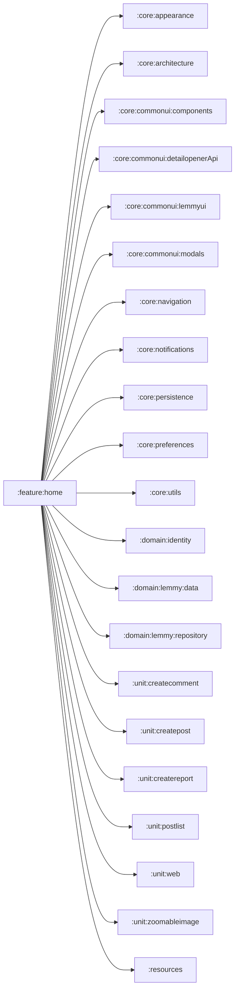
```mermaid
flowchart LR
    :feature:home --> :core:appearance
    :feature:home --> :core:architecture
    :feature:home --> :core:commonui:components
    :feature:home --> :core:commonui:detailopenerApi
    :feature:home --> :core:commonui:lemmyui
    :feature:home --> :core:commonui:modals
    :feature:home --> :core:navigation
    :feature:home --> :core:notifications
    :feature:home --> :core:persistence
    :feature:home --> :core:preferences
    :feature:home --> :core:utils
    :feature:home --> :domain:identity
    :feature:home --> :domain:lemmy:data
    :feature:home --> :domain:lemmy:repository
    :feature:home --> :unit:createcomment
    :feature:home --> :unit:createpost
    :feature:home --> :unit:createreport
    :feature:home --> :unit:postlist
    :feature:home --> :unit:web
    :feature:home --> :unit:zoomableimage
    :feature:home --> :resources
```

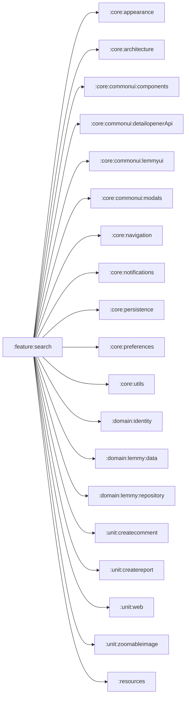
```mermaid
flowchart LR
    :feature:search --> :core:appearance
    :feature:search --> :core:architecture
    :feature:search --> :core:commonui:components
    :feature:search --> :core:commonui:detailopenerApi
    :feature:search --> :core:commonui:lemmyui
    :feature:search --> :core:commonui:modals
    :feature:search --> :core:navigation
    :feature:search --> :core:notifications
    :feature:search --> :core:persistence
    :feature:search --> :core:preferences
    :feature:search --> :core:utils
    :feature:search --> :domain:identity
    :feature:search --> :domain:lemmy:data
    :feature:search --> :domain:lemmy:repository
    :feature:search --> :unit:createcomment
    :feature:search --> :unit:createreport
    :feature:search --> :unit:web
    :feature:search --> :unit:zoomableimage
    :feature:search --> :resources
```

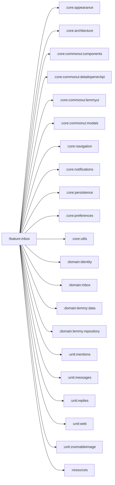
```mermaid
flowchart LR
    :feature:inbox --> :core:appearance
    :feature:inbox --> :core:architecture
    :feature:inbox --> :core:commonui:components
    :feature:inbox --> :core:commonui:detailopenerApi
    :feature:inbox --> :core:commonui:lemmyui
    :feature:inbox --> :core:commonui:modals
    :feature:inbox --> :core:navigation
    :feature:inbox --> :core:notifications
    :feature:inbox --> :core:persistence
    :feature:inbox --> :core:preferences
    :feature:inbox --> :core:utils
    :feature:inbox --> :domain:identity
    :feature:inbox --> :domain:inbox
    :feature:inbox --> :domain:lemmy:data
    :feature:inbox --> :domain:lemmy:repository
    :feature:inbox --> :unit:mentions
    :feature:inbox --> :unit:messages
    :feature:inbox --> :unit:replies
    :feature:inbox --> :unit:web
    :feature:inbox --> :unit:zoomableimage
    :feature:inbox --> :resources
```

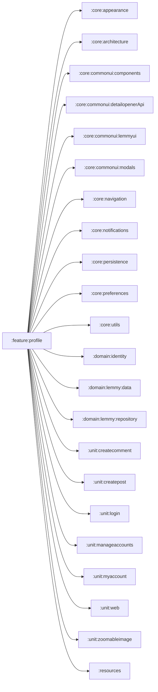
```mermaid
flowchart LR
    :feature:profile --> :core:appearance
    :feature:profile --> :core:architecture
    :feature:profile --> :core:commonui:components
    :feature:profile --> :core:commonui:detailopenerApi
    :feature:profile --> :core:commonui:lemmyui
    :feature:profile --> :core:commonui:modals
    :feature:profile --> :core:navigation
    :feature:profile --> :core:notifications
    :feature:profile --> :core:persistence
    :feature:profile --> :core:preferences
    :feature:profile --> :core:utils
    :feature:profile --> :domain:identity
    :feature:profile --> :domain:lemmy:data
    :feature:profile --> :domain:lemmy:repository
    :feature:profile --> :unit:createcomment
    :feature:profile --> :unit:createpost
    :feature:profile --> :unit:login
    :feature:profile --> :unit:manageaccounts
    :feature:profile --> :unit:myaccount
    :feature:profile --> :unit:web
    :feature:profile --> :unit:zoomableimage
    :feature:profile --> :resources
```

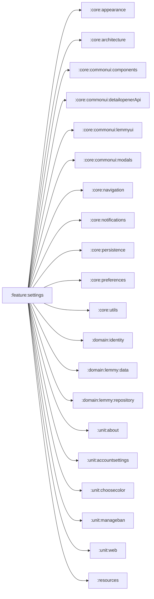
```mermaid
flowchart LR
    :feature:settings --> :core:appearance
    :feature:settings --> :core:architecture
    :feature:settings --> :core:commonui:components
    :feature:settings --> :core:commonui:detailopenerApi
    :feature:settings --> :core:commonui:lemmyui
    :feature:settings --> :core:commonui:modals
    :feature:settings --> :core:navigation
    :feature:settings --> :core:notifications
    :feature:settings --> :core:persistence
    :feature:settings --> :core:preferences
    :feature:settings --> :core:utils
    :feature:settings --> :domain:identity
    :feature:settings --> :domain:lemmy:data
    :feature:settings --> :domain:lemmy:repository
    :feature:settings --> :unit:about
    :feature:settings --> :unit:accountsettings
    :feature:settings --> :unit:choosecolor
    :feature:settings --> :unit:manageban
    :feature:settings --> :unit:web
    :feature:settings --> :resources
```

## Domain modules

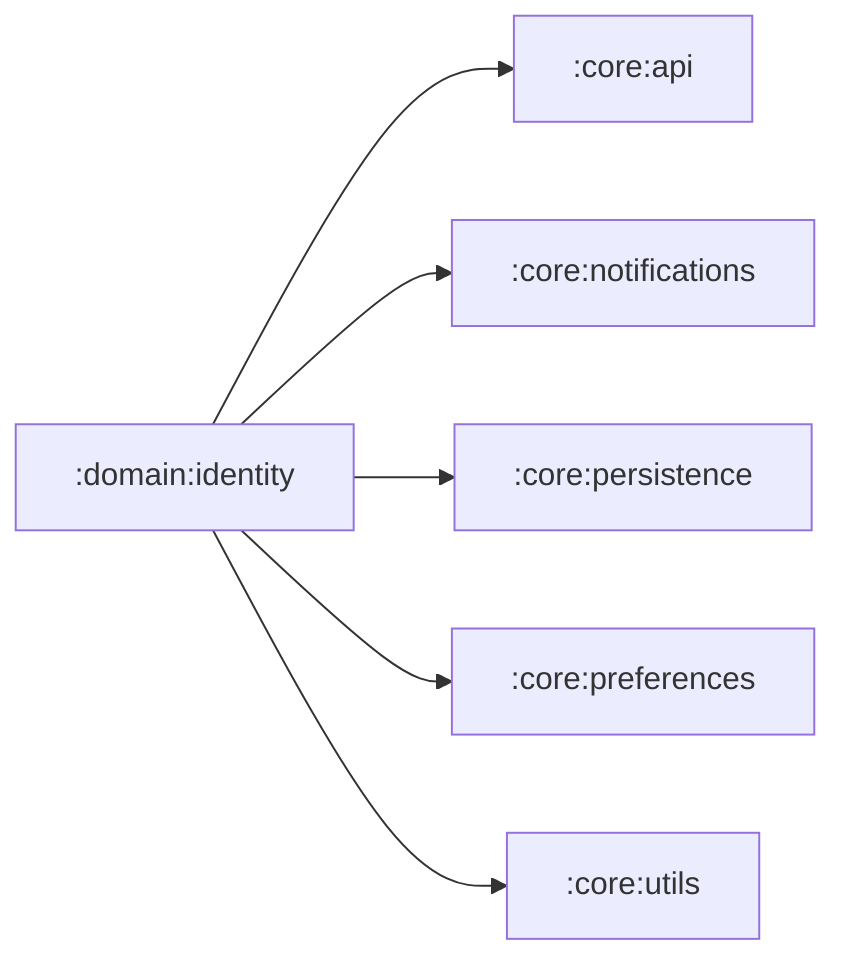
```mermaid
flowchart LR
    :domain:identity --> :core:api
    :domain:identity --> :core:notifications
    :domain:identity --> :core:persistence
    :domain:identity --> :core:preferences
    :domain:identity --> :core:utils
```

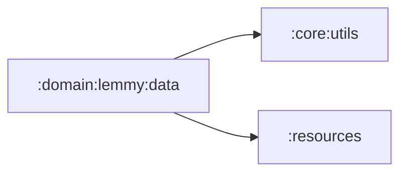
```mermaid
flowchart LR
    :domain:lemmy:data --> :core:utils
    :domain:lemmy:data --> :resources
```

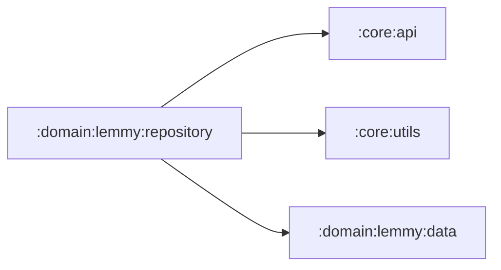
```mermaid
flowchart LR
    :domain:lemmy:repository --> :core:api
    :domain:lemmy:repository --> :core:utils
    :domain:lemmy:repository --> :domain:lemmy:data
```

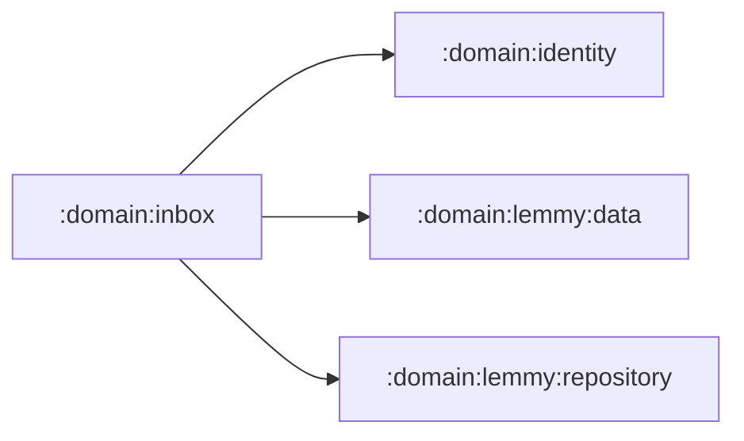
```mermaid
flowchart LR
    :domain:inbox --> :domain:identity
    :domain:inbox --> :domain:lemmy:data
    :domain:inbox --> :domain:lemmy:repository
```

## Unit modules

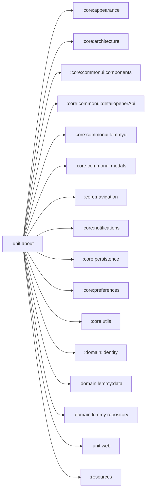
```mermaid
flowchart LR
    :unit:about --> :core:appearance
    :unit:about --> :core:architecture
    :unit:about --> :core:commonui:components
    :unit:about --> :core:commonui:detailopenerApi
    :unit:about --> :core:commonui:lemmyui
    :unit:about --> :core:commonui:modals
    :unit:about --> :core:navigation
    :unit:about --> :core:notifications
    :unit:about --> :core:persistence
    :unit:about --> :core:preferences
    :unit:about --> :core:utils
    :unit:about --> :domain:identity
    :unit:about --> :domain:lemmy:data
    :unit:about --> :domain:lemmy:repository
    :unit:about --> :unit:web
    :unit:about --> :resources
```

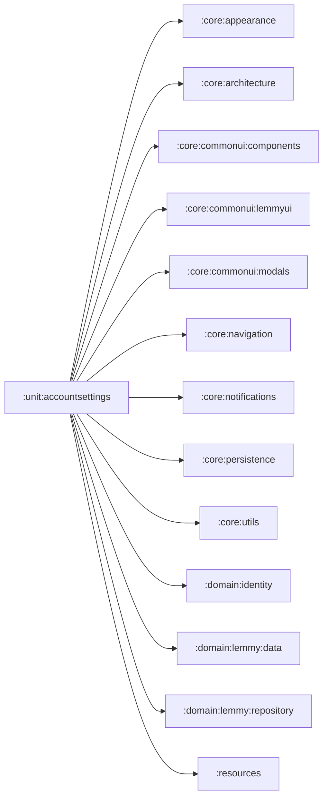
```mermaid
flowchart LR
    :unit:accountsettings --> :core:appearance
    :unit:accountsettings --> :core:architecture
    :unit:accountsettings --> :core:commonui:components
    :unit:accountsettings --> :core:commonui:lemmyui
    :unit:accountsettings --> :core:commonui:modals
    :unit:accountsettings --> :core:navigation
    :unit:accountsettings --> :core:notifications
    :unit:accountsettings --> :core:persistence
    :unit:accountsettings --> :core:utils
    :unit:accountsettings --> :domain:identity
    :unit:accountsettings --> :domain:lemmy:data
    :unit:accountsettings --> :domain:lemmy:repository
    :unit:accountsettings --> :resources
```

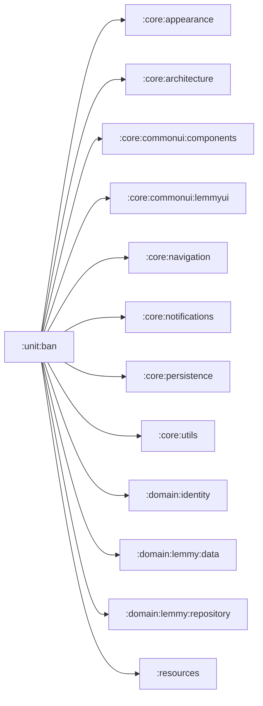
```mermaid
flowchart LR
    :unit:ban --> :core:appearance
    :unit:ban --> :core:architecture
    :unit:ban --> :core:commonui:components
    :unit:ban --> :core:commonui:lemmyui
    :unit:ban --> :core:navigation
    :unit:ban --> :core:notifications
    :unit:ban --> :core:persistence
    :unit:ban --> :core:utils
    :unit:ban --> :domain:identity
    :unit:ban --> :domain:lemmy:data
    :unit:ban --> :domain:lemmy:repository
    :unit:ban --> :resources
```

TBD

## Core modules

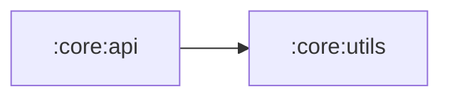
```mermaid
flowchart LR
    :core:api --> :core:utils
```

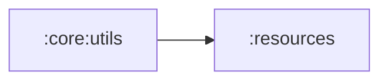
```mermaid
flowchart LR
    :core:utils --> :resources
```

TBD
