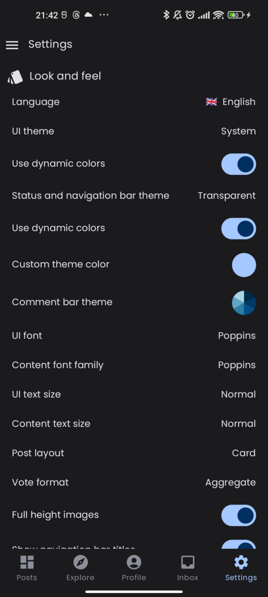
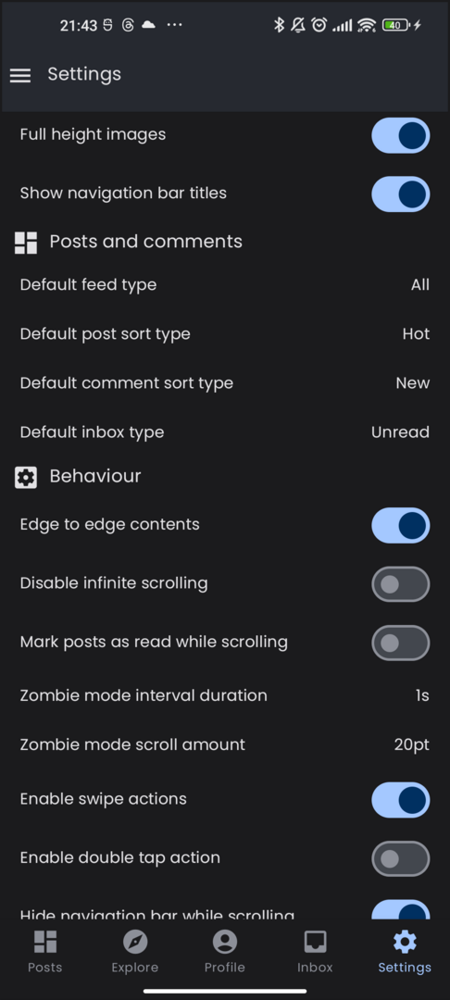
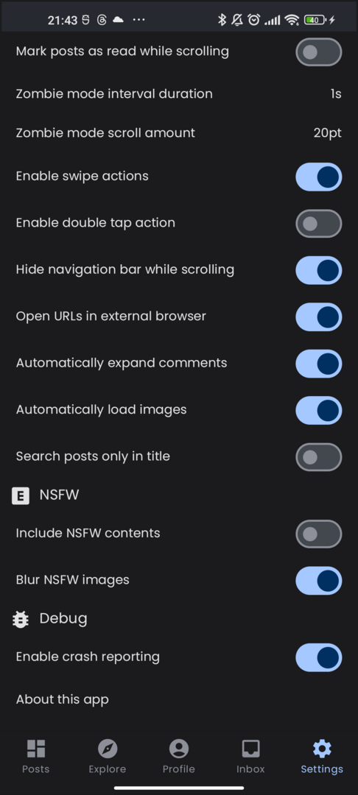

## Anonymous user

### Home screen

The home screen is made up by three components:

- the top bar where you can see the feed type ("All" or "Local"), the instance name "via ..." and
  the sort type;
- the post list, where for each post you can see the community and creator info, its title,
  image (if any), URL (if any), number of comments, most recent modification date and the vote;
- the bottom navigation bar, from which you can navigate to other application sections.

The format of each post item (card, compact or full) and the vote format (aggregated, separated,
percentage) as well as the font size/face can be configured in the Settings screen.

If you open the menu of the floating action button in the bottom right corner, you can go back to
the top or activate the "zombie mode" (i.e. automatic scrolling).

### Post detail

By selecting a post you can open the corresponding detail screen.

The detail screen shows the post creator and community info, title, cover image, URL, score and date
but also the textual body of the post if it is present.

After the post you can see the comments, each of which displays the creator, date, number of replies
and vote.

By using the "…" button you can access an additional menu about the post, e.g. you can see the raw
Markdown and inspect/copy its contents.

### Side menu

In anonymous mode, the side menu gives you the opportunity to change instance (the same menu can be
accessed by tapping the "via ..." label in the home top bar).

If your preferred instance is not listed, you can add a new one using the "+" button.

### Community detail

By tapping on the community info above each post title, you can open the community detail screen,
which is very similar to the home (you can activate the zombie mode here too).

If you tap on the "⋮" button in the top right corner you can also access some additional
information.

### User detail

Conversely, if you tap on the user name above the title, you will access the user detail screen
where it is possible to see the posts and comments created by that particular user.

If you tap on the "⋮" button in the top right corner you can also access some additional
information.

### Explore

The explore screens allows you to search Lemmy (among All or local feeds) for contents and filter by
a query string and result type (post, comment, communities, users or everything).

### Profile and Inbox

In anonymous mode the profile and inbox screens are just placeholders that invite you to access with
an account.

### Settings

The settings screen allows you to customize the look and behaviour of your app.

