## 1 Anonymous user

### 1.1 Home screen

The home screen is made up by three components:

- the top bar where you can see the feed type ("All" or "Local"), the instance name "via ..." and
  the sort type;
- the post list, where for each post you can see the community and creator info, its title,
  image (if any), URL (if any), number of comments, most recent modification date and the vote;
- the bottom navigation bar, from which you can navigate to other application sections.

The format of each post item (card, compact or full) and the vote format (aggregated, separated,
percentage) as well as the font size/face can be configured in the Settings screen.

If you open the menu of the floating action button in the bottom right corner, you can go back to
the top or activate the "zombie mode" (i.e. automatic scrolling).

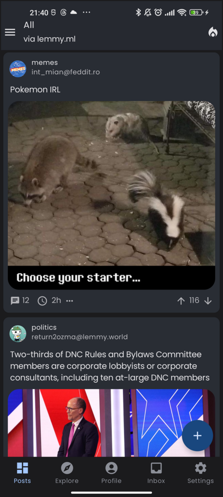
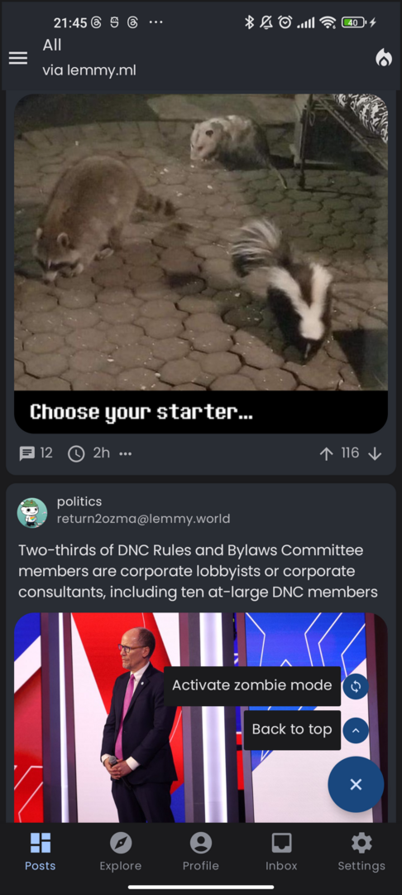

### 1.2 Post detail

By selecting a post you can open the corresponding detail screen.

The detail screen shows the post creator and community info, title, cover image, URL, score and date
but also the textual body of the post if it is present.

After the post you can see the comments, each of which displays the creator, date, number of replies
and vote.

By using the "…" button you can access an additional menu about the post, e.g. you can see the raw
Markdown and inspect/copy its contents.

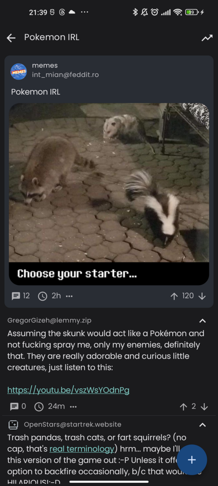
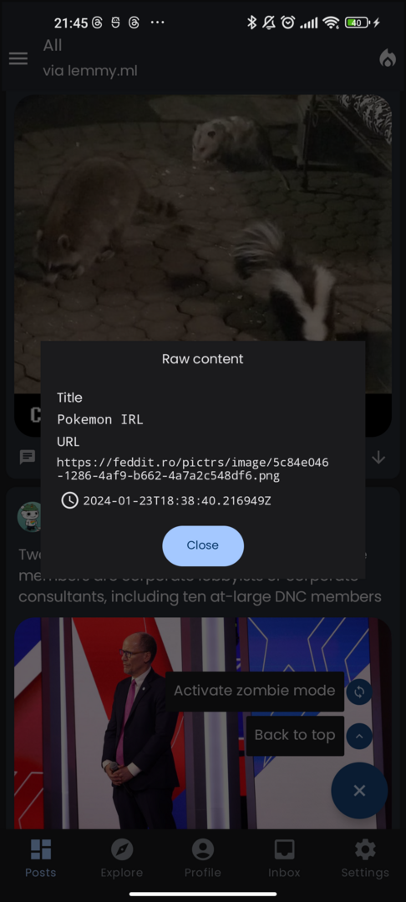

### 1.3 Side menu

In anonymous mode, the side menu gives you the opportunity to change instance (the same menu can be
accessed by tapping the "via ..." label in the home top bar).

If your preferred instance is not listed, you can add a new one using the "+" button.

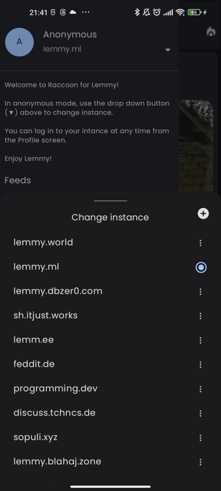
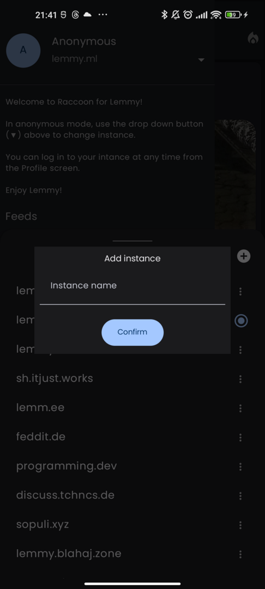

It is possible to reorder items in this list to arrange how instances are displayed.

### 1.4 Community detail

By tapping on the community info above each post title, you can open the community detail screen,
which is very similar to the home (you can activate the zombie mode here too).

If you tap on the "⋮" button in the top right corner you can also access some additional
information.

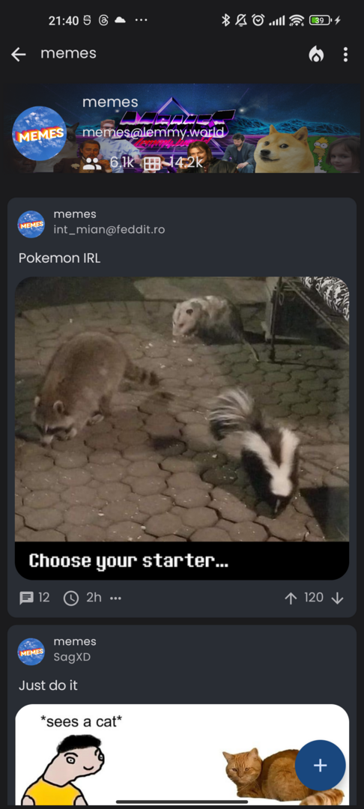
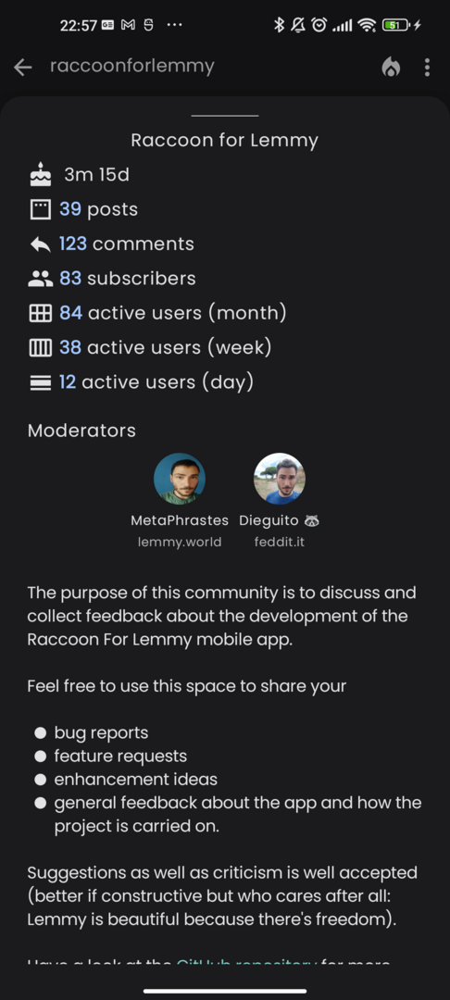

### 1.5 User detail

Conversely, if you tap on the user name above the title, you will access the user detail screen
where it is possible to see the posts and comments created by that particular user.

If you tap on the "⋮" button in the top right corner you can also access some additional
information.

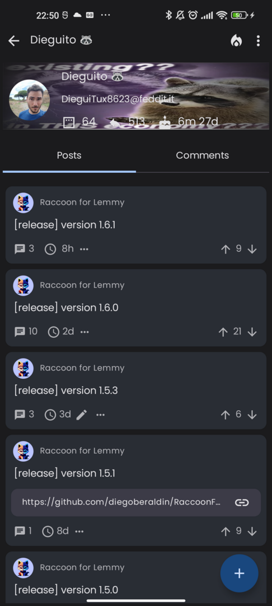
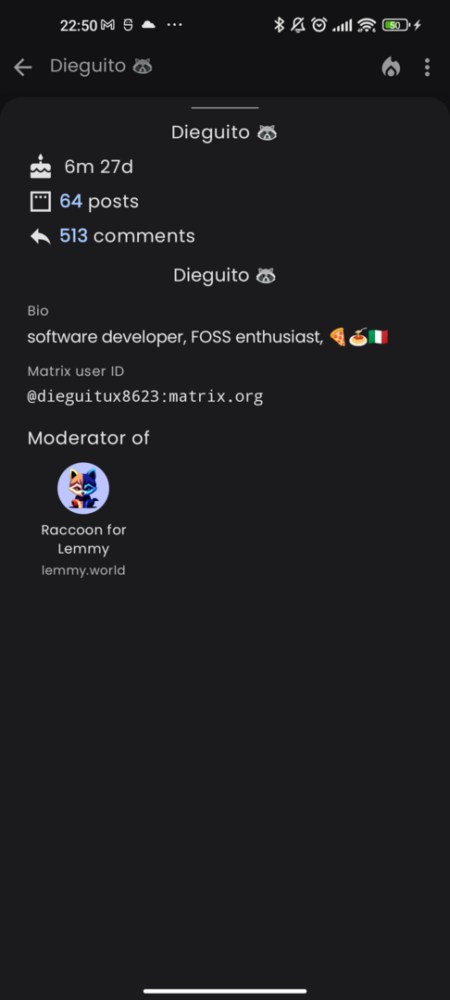

### 1.6 Explore

The explore screens allows you to search Lemmy (among All or local feeds) for contents and filter by
a query string and result type (post, comment, communities, users or everything).

You can change the result type with the second to last action in the top bar, the available options are:

- posts
- communities
- comments
- users
- URLs.

As in the home screen, you can change the sort type with the last action on the right in the top bar.

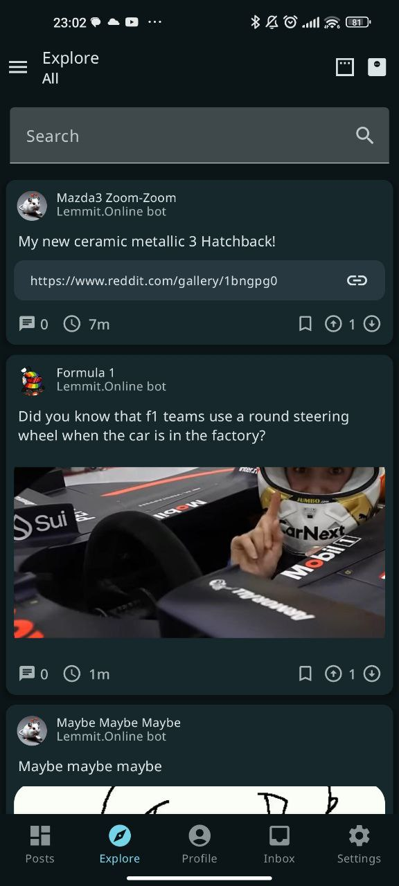

### 1.7 Profile and Inbox

In anonymous mode the profile and inbox screens are just placeholders that invite you to access with
an account.

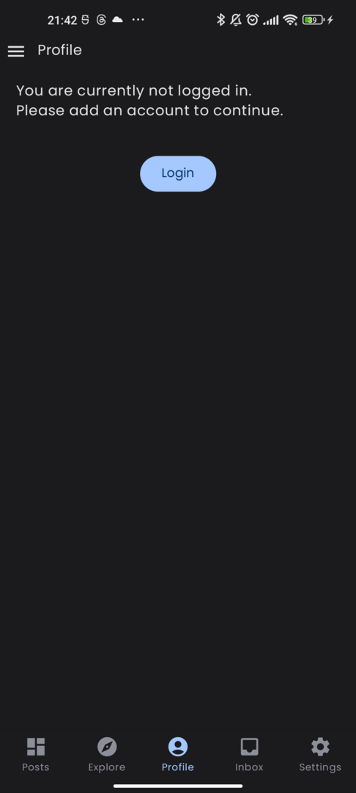
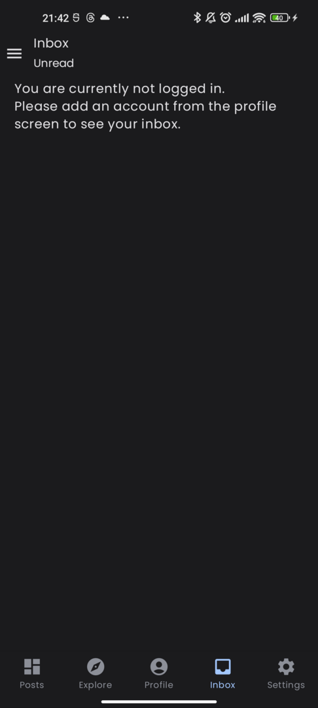

### 1.8 Settings

The settings screen allows you to customize the look and behaviour of your app.

- Look and feel:
    - Language: choose UI language (app specific);
    - UI theme: choose between light, dark, totally dark or system theme;
    - Application appearance: opens the configuration screen for colors and fonts of the user interface;
    - Content appearance: opens the configuration screen for fonts and style of posts and comments;
- General:
    - Default feed type: listing type for the home screen applied by default
    - Default post sort type: sort type for the home, community detail and user detail applied by
      default;
    - Default comment sort type: sort type for post detail applied by default to comments;
    - Open URLs in external browser: rely on the external browser instead of in-app web view;
    - Advanced settings: opens a detailed configuration screen for more advanced options;
- NSFW:
    - Include NSFW contents: determine whether NSFW contents are included in the feed by default;
    - Blur NSFW images: in home feed and community (unless the community is marked as NSFW as a
      whole) and user detail when a post is marked as NSFW, and the URL contains an image, the image
      is blurred;
- Debug:
    - Enable crash reporting: if this option is enabled, in case the application crashes you will
      find the stack trace in a file on your local device (*);
    - About this app: shows a dialog with the app versions and some useful shortcuts to reach out to
      the developers or other members of the community;
    - User manual: opens the application manual online (this page).

(*) Look for a file named  `crash_report.txt` in the Documents directory of the private storage area
reserved for the app, e.g.

```
/sdcard/Android/data/com.github.diegoberaldin.raccoonforlemmy.android.dev/files/Documents/crash_report.txt
```

via adb or the "Device Explorer" if you are using Android Studio.

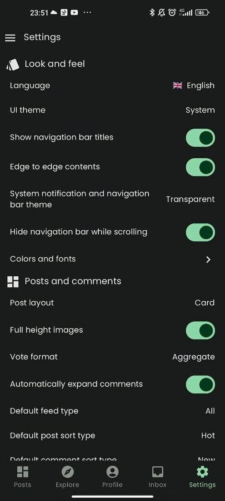
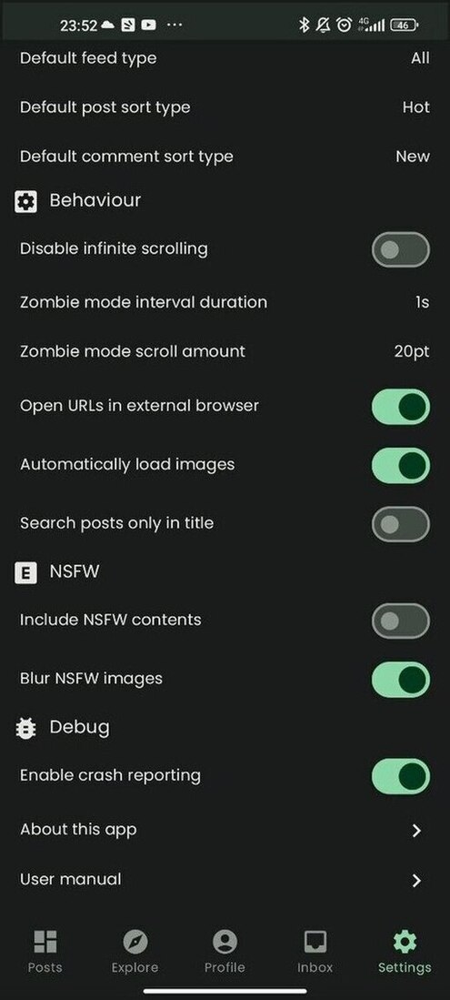

#### 1.8.1 Application appearance

This screen allows to configure colors and fonts of the UI:

- Use dynamic colors: (on Android 12+) generate a palette based on your background dominant
  color;
- Custom theme color: (requires "Use dynamic color" option to be off) generate a palette by
  choosing a seed color from a predefined list or custom color;
- Comment bar theme: palette of colors used to distinguish nested comments;
- UI font: typeface used for the app UI elements (menus, labels, etc.);
- UI text size: scale factor to apply to the app UI elements;

By the way, if you like Android dynamic colors and you think that on Lemmy there are plenty of
beautiful images you could set as your home screen background, have a look
at [this side project](https://github.com/diegoberaldin/CommonGround) of mine. It is a simple app
that allows you to configure remote image sources from the Lemmy-verse, preview how they look like
and set them easily as wallpapers for your home and lock screens.

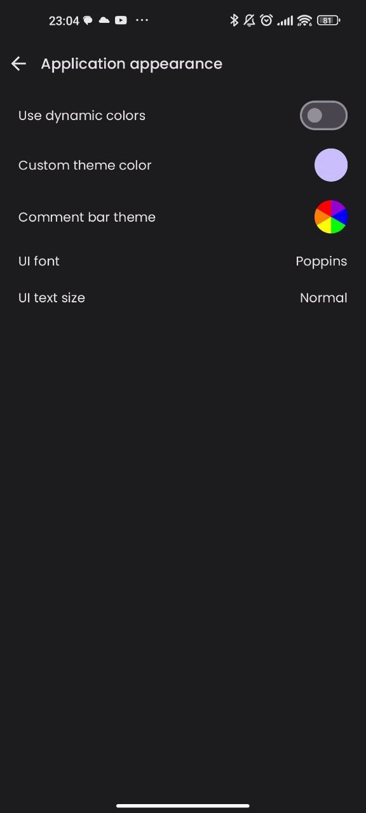

#### 1.8.2 Content appearance

This screen is useful to configure the aspect of Lemmy contents (usernames, community names, post and comments).

- Text
    - Content font family: typeface used for post and comments on Lemmy;
    - Title text size:
    - Post text size:
    - Comment text size:
    - Ancillary text size:
- Customizations:
    - Post layout:  choose a layout (Card, Compact, Full) for posts;
    - Use display names for users and communities: if enabled, uses the user display name and the
      community title whenever possible, otherwise fallbacks to Lemmy handles (
      e.g. `!raccoonforlemmy@lemmy.world`);
    - Full height images: show images with scaled width and full height (instead of capping the
      height) in the feed;
    - Vote format: see the score of posts and comments as aggregated (`upvotes - downvotes`), split
      or percentage (`upvotes / (upvotes + downvotes) * 100`);
    - Comment bar thickness: allows to customize a multiplier applied to the width of comment bar indicating
      the depth on the left of each comment.

You can see a preview of the result below the list of options.

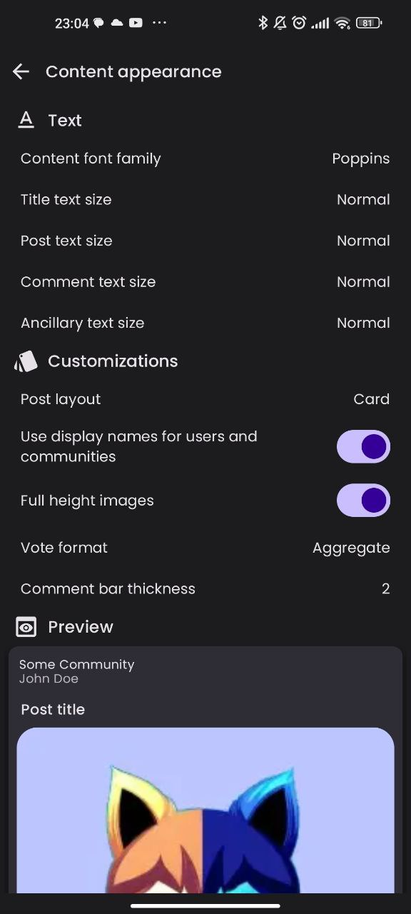
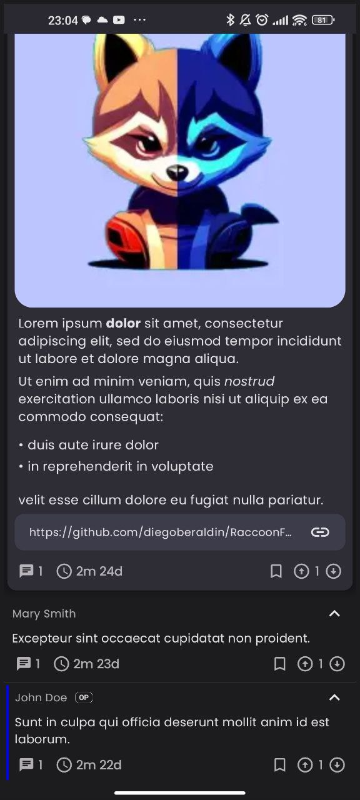

#### 1.8.3 Advanced settings

This screen contains a series of less frequently used customization options:

- Display:
    - Show navigation bar titles: include the section titles in the bottom navigation bar;
    - Edge to edge contents: enable the view from top to bottom edge for home, community detail,
      user detail, post detail and profile to maximize the space dedicated to contents;
    - System notification and navigation bar theme: if you enable edge-to-edge display, choosing "
      Transparent" makes the status and nav bar completely transparent, otherwise they have the
      system color with a slight alpha to make them more visible;
    - Hide navigation bar while scrolling: makes the bottom navigation bar invisible while scrolling
      down to maximize the space dedicated to contents;
- Reading and contents:
    - Default feed type for explore: default listing type used in the Explore screen;
    - Default language in editor: language for newly created posts and comments;
    - Disable infinite scrolling: if this option is enabled, instead of automatically fetching new
      contents while scrolling (in home, community detail, post detail, user detail) an explicit "
      Load more" button is shown, in order to prevent the "doom scrolling" effect;
    - Automatically expand comments: expand all comment threads while opening the post detail;
    - Zombie mode interval duration: amount of time between automatic scroll in "lazy mode";
    - Zombie mode scroll amount: translation amount for the automatic scroll in "lazy mode";
- Pictures
    - Automatically load images: load images and videos automatically in post and comments;
    - Save images in specific subdirectories: use the community or user handle to save images when downloading them
      into your Gallery;
- Experiments:
    - Search posts only in title: enable exact match in the Explore section while searching posts;

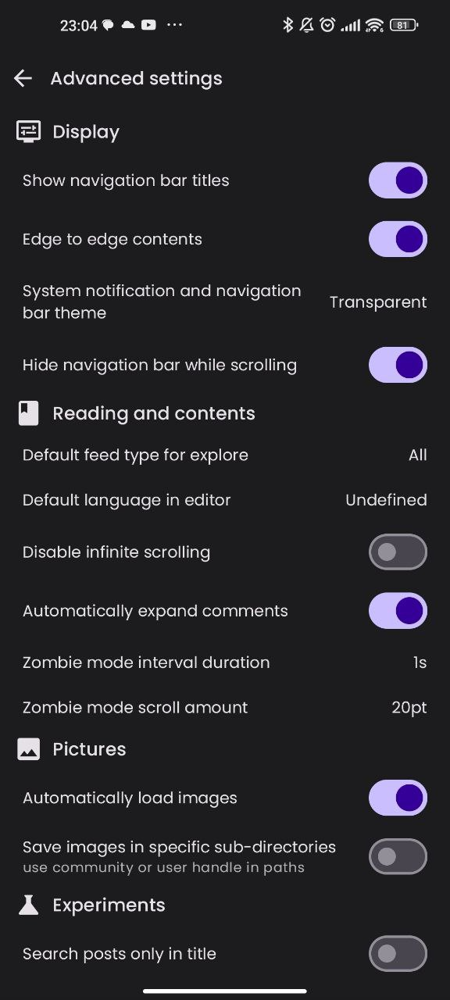

### 1.9 Moderation log

The moderation log can be accessed from the community detail using the "⋮" button. It contains a
list of all the actions that happened for that given community, e.g.:

- users being promoted (or removed) to moderator;
- posts and comments being removed/restored;
- posts being locked (prevent further comments) or unlocked;
- posts being featured;
- comments being marked as distinguished;
- community being transferred.

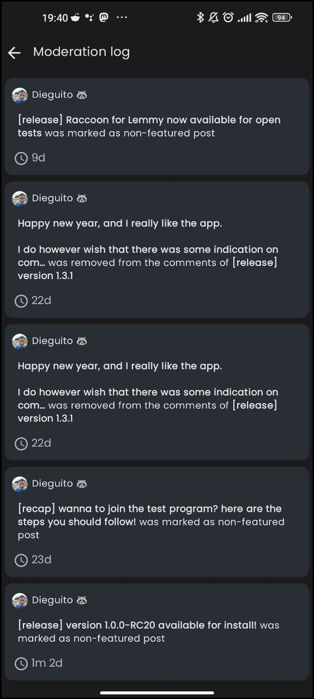
