## 2 Logged user

### 2.1 Home

When you are logged, as for anonymous users, the home screen contains the post list with the same information displayed.
The main difference is that, as a logged user, you can save posts and vote (either up or down)
contents. You will also find more options in the "…" button.

The floating action button contains an option to hide read posts for logged users, a post is
considered read when you have voted or saved it, opened its detail, opened its image or (if you
enabled the "Mark read while scrolling" option in the Settings screen) just seen it in the feed.

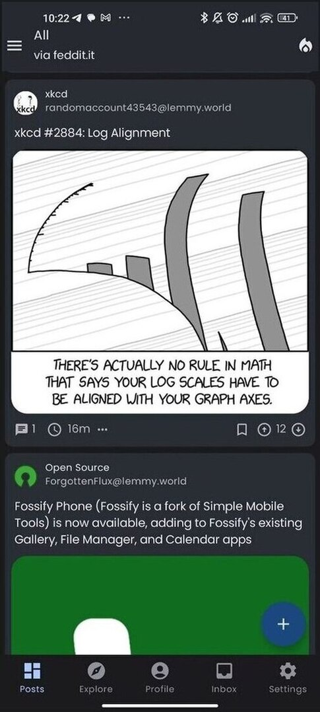
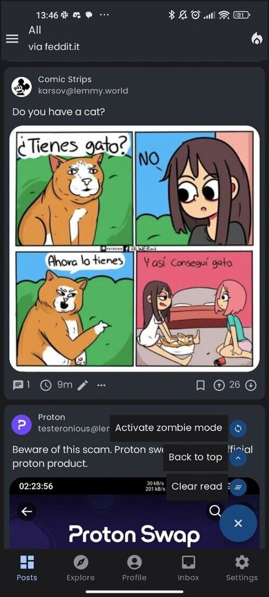

### 2.2 Sidebar

The side menu allows to see the list of subscriptions, with the ones that you marked as favorite to the top of the list.
By clicking on each item, you will open the corresponding community or multi-community detail.

You can use the search field to look for a specific community.

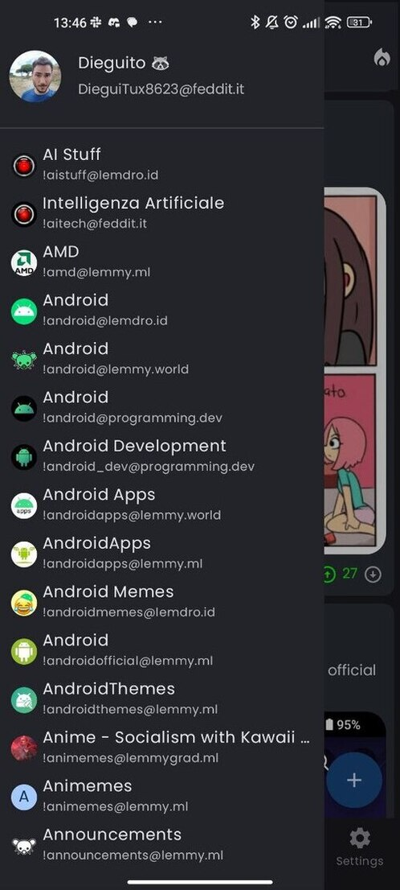

### 2.3 Explore

The Explore screen is similar to the one of anonymous users. Like in the home screen, the difference
if that you can vote, save and reply to contents you are seeing.

### 2.4 Profile

The Profile screen shows the list of post and comments that you created and some textual statistics
about your post and comment count and your Lemmy-birthday.

Above the post and comments, you can find the shortcuts to access the following sections:

- Manage subscriptions: a screen where you can review your subscriptions and create multi-communities
- Saved: access the list of your saved items (posts and comments);
- Drafts: access the unfinished posts and comments that you have saved;
- Upvotes &amp; downvotes: review the contents that you have liked or disliked;
- Moderation tools: if you are a moderator you can easily access:
    - Report list: list of all the reports for posts and comments in your communities;
    - Moderation log: global moderation log;
    - Moderated contents: review all the contents that have been posted (either in the form of posts or comments) to
      your communities.

In the top right corner of the app bar, you'll find a button to log out and another one to change
account (or access with a different one).

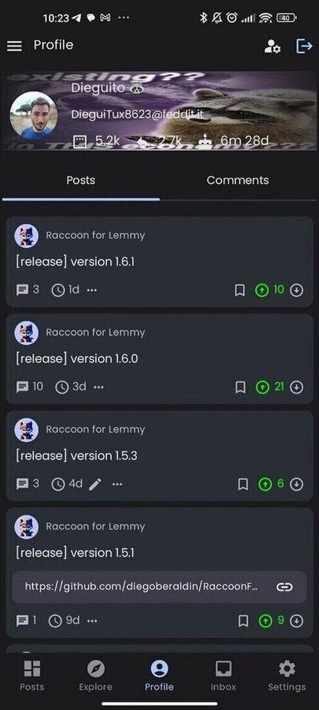
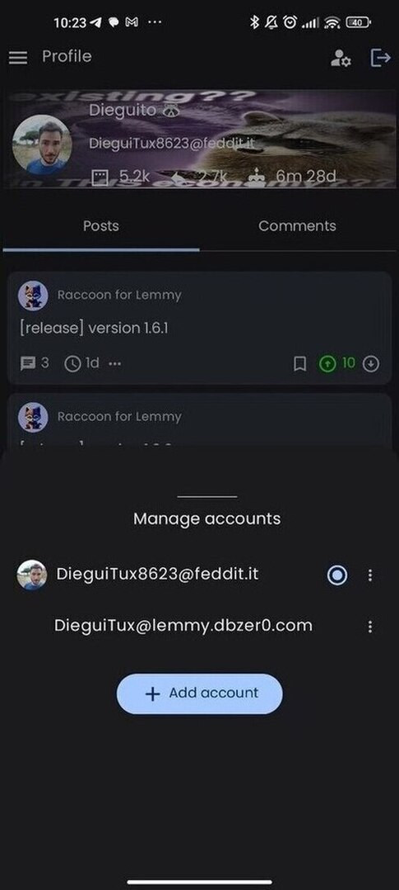

### 2.5 Inbox

The Inbox screen is divided into three sections:

- Replies: contains the comments that were created as a reply to your post or comments;
- Mentions: contains the contents where your user has been mentioned by other users;
- Messages: contains the direct messages that other users have sent to you, grouped by users as a
  chat.

You can select (using the top bar) which filter to apply, i.e. whether all items should be included
or just unread ones.

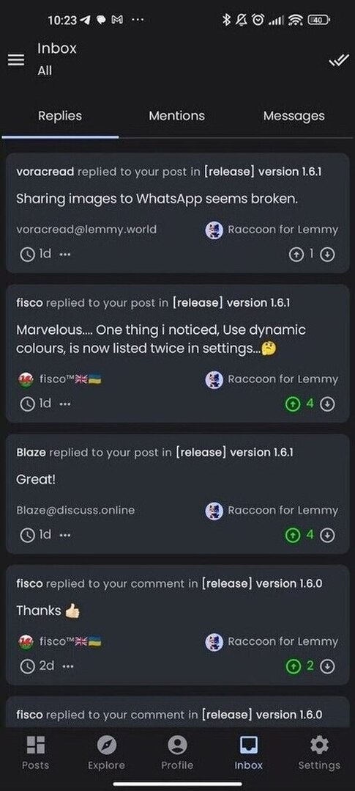

### 2.6 Settings

The settings screen for logged users is very similar to the one of anonymous users, but it has some
additional items and sub-screens.

Please refer to [description of the page](#18-settings) for anonymous users for the common parts,
a short description of the additional functions will follow.

- General:
    - Default feed type: you will find the "Subscribed" option which is not available for anonymous users;
    - Enable swipe actions:whether the swipe to left/right actions are enabled in post and comment
      list, inbox and reports;
    - Configure swipe actions: opens the configure swipe actions screen;
- Account settings:
    - Web preferences: allows you to edit your Lemmy web preferences;
    - Bans and filters: configure user/community/instance ban and filtering options.

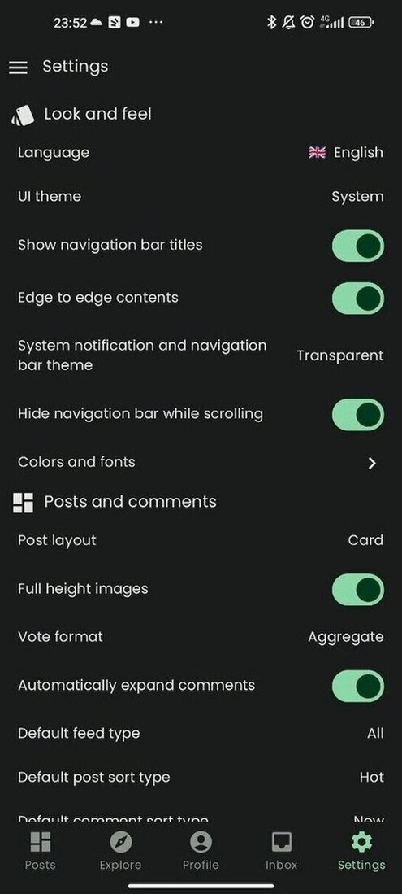
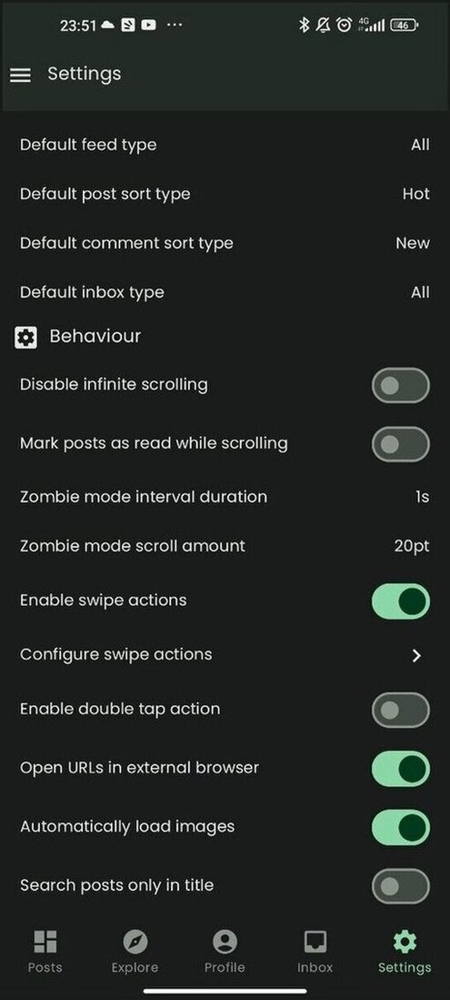

#### 2.6.1 Application appearance

This screen is similar to the one for anonymous users, but additionally it allows to configure custom colors for swipe
actions:

- Upvote color: color of the upvote action (both used as a card background when swiping and to
  highlight the vote indicator when you have upvoted a content);
- Downvote color: color of the downvote action (both used as a card background when swiping and
  to highlight the vote indicator when you have downvoted a content);
- Reply action color: card background color for the reply action;
- Save action color: card background color for the save action;

#### 2.6.2 Advanced settings

Even in this case, the screen is very similar to the one anonymous users are presented, but it has some additional
options:

- Reading and contents:
    - Default inbox type: whether the Inbox includes all contents by default of just unread ones;
    - Mark posts as read when scrolling: instead of marking posts read with an explicit
      interaction, posts are marked as read on the fly as they become visible while scrolling;
- Experiments:
    - Enable double tap action: instead of using swipe actions, this option activated the "double tap to like" mode some
      users may be familiar with from other social apps.

#### 2.6.2 Configure swipe actions

In this screen it is possible to assign an action to the 4 slots (two on the left side and two on
the right side) of the cards used to render post, comments and inbox items.

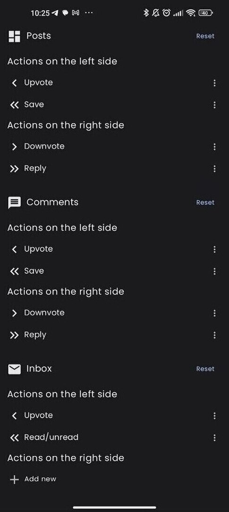

#### 2.6.3 Web account settings

This screen lets you configure some preferences associated to your Lemmy account (similarly to what
you can do on the webapp).

#### 2.6.4 Ban and filter options

This screen allows you to see what users, communities and instances you have blocked and
remove the block (these settings are tied to your Lemmy account too).

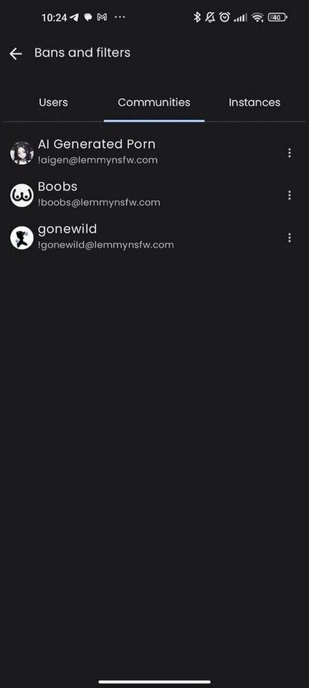

### 2.7 Moderation tools

As a moderator, you can access the list of reports that users have submitted about posts and
comments in your community. The report list can be accessed by the community detail, using the "⋮"
button in the top right corner.

The report list screen can be filtered like the inbox (including all items or just unresolved ones)
and it is divided in two sections:

- Posts: reported posts;
- Comments: reported comments;

For each report you can see the reason that was specified by the reporting users, you can open the
content (e.g. to remove it) and you can mark the report as "resolved" once you are done with it.

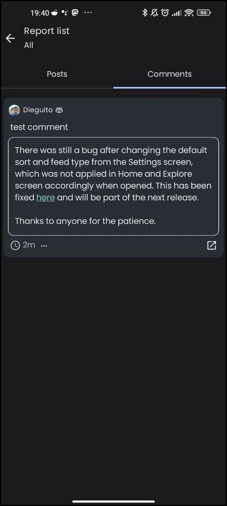

