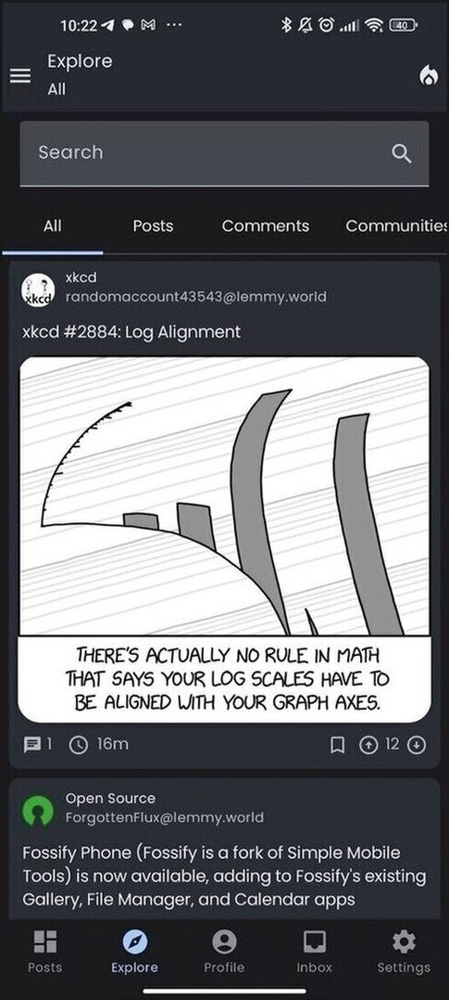

## Logged user

### Home

As for anonymous users, the home screen contains the post list with the same information displayed.
The main difference is that, as a logged user, you can save posts and vote (either up or down)
contents. You will also find more options in the "…" button.

The floating action button contains an option to hide read posts for logged users, a post is
considered read when you have voted or saved it, opened its detail, opened its image or (if you
enabled the "Mark read while scrolling" option in the Settings screen) just seen it in the feed.

### Sidebar

For logged users, the side menu allows to see the list of subscriptions, with the ones that you
marked as favorite to the top of the list. By clicking on each item, you will open the corresponding
community or multi-community detail.

### Explore

The Explore screen is similar to the one of anonymous users. Like in the home screen, the difference
if that you can vote, save and reply to contents you are seeing.

### Profile

The Profile screen shows the list of post and comments that you created and some textual statistics
about your post and comment count and your Lemmy-birthday.

In the top right corner of the app bar, you'll find a button to log out and another one to change
account (or access with a different one).

