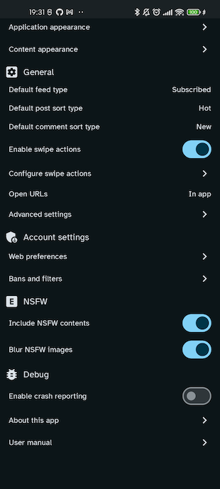
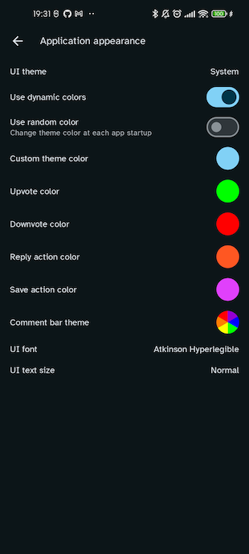

# User manual

This page contains a short description of the main features of the app.

## Home screen

The home screen is made up by three components:

- the top bar where you can see the feed type ("All" or "Local"), the instance name "via ..." and
  the sort type;
- the post list, where for each post you can see the community and creator info, its title,
  image (if any), URL (if any), number of comments, most recent modification date and the vote;
- the bottom navigation bar, from which you can navigate to other application sections.

The format of each post item (card, compact or full) and the vote format (aggregated, separated,
percentage) as well as the font size/face can be configured in the Settings screen.

If you are logged, you can save posts to bookmarks and vote then (with either a positive or a
negative vote). You will also find more options in the "…" button.

If you open the menu of the floating action button in the bottom right corner, you can go back to
the top or activate the "zombie mode" (i.e. automatic scrolling).

If you are logged, the floating action button contains an option to hide read posts — a post is
considered read when you have voted or saved it, opened its detail, opened its image or (if you
enabled the "Mark read while scrolling" option in the Settings screen) just seen it in the feed.

<div align="center">


</div>

## Side menu

In anonymous mode, the side menu gives you the opportunity to change instance (the same menu can be
accessed by tapping the "via …" label in the home top bar).

If your preferred instance is not listed, you can add a new one using the "+" button. It is possible
to reorder items in this list to arrange how instances are displayed.

If you are logged, the side menu allows to see the list of subscriptions, with the ones that you
marked as favorite to the top of the list. You can use the search field to look for a specific
community.

By clicking on each item, you will open the corresponding community or multi-community detail.

<div align="center">


</div>

## Post detail

By selecting a post you can open the corresponding detail screen.

The detail screen shows the post creator and community info, title, cover image, URL, score and date
but also the textual body of the post if it is present.

After the post you can see the comments, each of which displays the creator, date, number of replies
and vote.

By using the "…" button you can access an additional menu about the post, e.g. you can see the raw
Markdown and inspect/copy its contents.

If you are logged, you can vote or save to bookmark both the main post and all its comments.

<div align="center">

</div>

## Community detail

By tapping on the community info above each post title, you can open the community detail screen,
which is very similar to the home (you can activate the zombie mode here too).

If you tap on the "⋮" button in the top right corner you can also access some additional
information and, if you are logged and are a moderator for this community, you will be able to edit
its metadata.

If you are logged, you can vote or save to bookmark each post in the list and access the same post
actions which you can find in the [timeline](#home-screen).

<div align="center">


</div>

## Instance detail

From the "⋮" button of a community detail you can open the "Instance detail" page which shows a list
of the communities in this instance (as well as a short description of the instance if it is
available). This is useful because you can sort communities and explore the instance.

<div align="center">

</div>

## User detail

If you tap on the user name above the title, you will access the user detail screen
where it is possible to see the posts and comments created by that particular user.

If you tap on the "⋮" button in the top right corner you can also access some additional
information.

<div align="center">


</div>

## Explore

The explore screens allows you to search Lemmy (among All or local feeds) for contents and filter by
a query string and result type (post, comment, communities, users or everything).

You can change the result type with the second to last action in the top bar, the available options
are:

- posts
- communities
- comments
- users
- URLs.

As in the [home screen](#home-screen), you can change the sort type with the last action on the
right in the top bar and, if you are logged, you can vote posts or add them to bookmarks.

<div align="center">


</div>

## Profile

The Profile screen shows the list of post and comments that you created and some textual statistics
about your post and comment count and your Lemmy-birthday.

Above the post and comments, you can find the shortcuts to access the following sections:

- Manage subscriptions: a screen where you can review your subscriptions and create
  multi-communities
- Saved: access the list of your saved items (posts and comments);
- Drafts: access the unfinished posts and comments that you have saved;
- Upvotes &amp; downvotes: review the contents that you have liked or disliked;
- Moderation tools: if you are a moderator you can easily access:
    - Report list: list of all the reports for posts and comments in your communities;
    - Moderation log: global moderation log;
    - Moderated contents: review all the contents that have been posted (either in the form of posts
      or comments) to your communities.

In the top right corner of the app bar, you'll find a button to log out and another one to change
account (or access with a different one).

In anonymous mode the profile is just a placeholder that invite you to access with an account or
retry the login if your token has expired.

<div align="center">


</div>

## Inbox

The Inbox screen is divided into three sections:

- Replies: contains the comments that were created as a reply to your post or comments;
- Mentions: contains the contents where your user has been mentioned by other users;
- Messages: contains the direct messages that other users have sent to you, grouped by users as a
  chat.

You can select (using the top bar) which filter to apply, i.e. whether all items should be included
or just unread ones.

In anonymous mode the profile is just a placeholder that invite you to access with an account.

<div align="center">


</div>

## Settings

The settings screen allows you to customize the look and behaviour of your app.

- Look and feel:
    - Language: choose UI language (app specific);
    - UI theme: choose between light, dark, totally dark or system theme;
    - Application appearance: opens the configuration screen for colors and fonts of the user
      interface;
        - Content appearance: opens the configuration screen for fonts and style of posts and
          comments;
- General:
    - Default feed type: listing type for the home screen applied by default
    - Default post sort type: sort type for the home, community detail and user detail applied by
      default;
    - Default comment sort type: sort type for post detail applied by default to comments;
    - Enable swipe actions: (only for logged users) whether the swipe to left/right actions are
      enabled in post and comment list, inbox and reports;
    - Configure swipe actions: (only for logged users) opens the configure swipe actions screen;
        - Open URLs in external browser: rely on the external browser instead of in-app web view;
        - Advanced settings: opens a detailed configuration screen for more advanced options;
- Account settings (only for logged users):
    - Web preferences: allows you to edit your Lemmy web preferences;
    - Bans and filters: configure user/community/instance ban and filtering options.
- NSFW:
    - Include NSFW contents: determine whether NSFW contents are included in the feed by default;
    - Blur NSFW images: in home feed and community (unless the community is marked as NSFW as a
      whole) and user detail when a post is marked as NSFW, and the URL contains an image, the image
      is blurred;
- Debug:
    - Enable crash reporting: if this option is enabled, in case the application crashes you will
      find the stack trace in a file on your local device;<a href="#crash-report-file">*</a>
    - About this app: shows a dialog with the app versions and some useful shortcuts to reach out to
      the developers or other members of the community;
    - User manual: opens the application manual online (this page).

<p id="crash-report-file">
* Look for a file named  `crash_report.txt` in the Documents directory of the private storage area
reserved for the app, e.g.
</p>

```
/sdcard/Android/data/com.livefast.eattrash.raccoonforlemmy.android.dev/files/Documents/crash_report.txt
```

via adb or the "Device Explorer" if you are using Android Studio.

<div align="center">


</div>

### Application appearance

This screen allows to configure colors and fonts of the UI:

- UI theme: allows to set the color set for the UI (e.g. light or dark);
- Use dynamic colors: (on Android 12+) generate a palette based on your background dominant color;
- Use random color: use a random theme color at each startup;
- Custom theme color: (requires "Use dynamic color" option to be off) generate a palette by
  choosing a seed color from a predefined list or custom color;
- Upvote color: (logged only) color of the upvote action (both used as a card background when
  swiping and to highlight the vote indicator when you have upvoted a content);
- Downvote color: (logged only) color of the downvote action (both used as a card background when
  swiping and to highlight the vote indicator when you have downvoted a content);
- Reply action color: (logged only) card background color for the reply action;
- Save action color: (logged only) card background color for the save action;
- Comment bar theme: palette of colors used to distinguish nested comments;
- UI font: typeface used for the app UI elements (menus, labels, etc.);
- UI text size: scale factor to apply to the app UI elements;

<div align="center">

</div>

### Content appearance

This screen is useful to configure the aspect of Lemmy contents (usernames, community names, post
and comments).

- Text
    - Content font family: typeface used for post and comments on Lemmy;
    - Title text size: scale factor applied to post titles;
    - Post text size: scale factor applied to post text;
    - Comment text size: scale factor applied to comment text;
    - Ancillary text size: scale factor applied to user names and other ancillary labels;
- Customizations:
- Post layout:  choose a layout (Card, Compact, Full) for posts;
- Use display names for users and communities: if enabled, uses the user display name and the
  community title whenever possible, otherwise fallbacks to Lemmy handles (
  e.g. `!raccoonforlemmy@lemmy.world`);
- Full height images: show images with scaled width and full height (instead of capping the
  height) in the feed;
- Full width images: enables horizontal edge-to-edge for images in timelines;
    - Vote format: see the score of posts and comments as aggregated (`upvotes - downvotes`), split
      or percentage (`upvotes / (upvotes + downvotes) * 100`);
    - Comment bar thickness: allows to customize a multiplier applied to the width of comment bar
      indicating
      the depth on the left of each comment.

You can see a preview of the result below the list of options.

<div align="center">

</div>

### Advanced settings

This screen contains a series of less frequently used customization options:

- Display:
    - Show navigation bar titles: include the section titles in the bottom navigation bar;
    - Edge to edge contents: enable the view from top to bottom edge for home, community detail,
      user detail, post detail and profile to maximize the space dedicated to contents;
    - System notification and navigation bar theme: if you enable edge-to-edge display, choosing "
      Transparent" makes the status and nav bar completely transparent, otherwise they have the
      system color with a slight alpha to make them more visible;
    - Hide navigation bar while scrolling: makes the bottom navigation bar invisible while scrolling
      down to maximize the space dedicated to contents;
- Reading and contents:
    - Default feed type for explore: default listing type used in the Explore screen;
    - Default inbox type: (logged only) whether the Inbox includes all contents by default of just
      unread ones;
        - Default language in editor: language for newly created posts and comments;
        - Disable infinite scrolling: if this option is enabled, instead of automatically fetching
          new
          contents while scrolling (in home, community detail, post detail, user detail) an explicit
          "Load more" button is shown, in order to prevent the "doom scrolling" effect;
        - Automatically expand comments: expand all comment threads while opening the post detail;
    - Mark posts as read when scrolling: (logged only) instead of marking posts read with an
      explicit
      interaction, posts are marked as read on the fly as they become visible while scrolling;
        - Zombie mode interval duration: amount of time between automatic scroll in "lazy mode";
        - Zombie mode scroll amount: translation amount for the automatic scroll in "lazy mode";
- Pictures
    - Automatically load images: load images and videos automatically in post and comments;
    - Save images in specific subdirectories: use the community or user handle to save images when
      downloading them
      into your Gallery;
- Experiments:
    - Configure bottom navigation bar: open a screen to reorder and add/remove items from the bottom
      navigation bar;
    - Add/remove favorites in navigation drawer: enable the "favorites" section in the side menu;
    - Enable double tap action: (logged only) instead of using swipe actions, this option activated
      the "double tap to like" mode some users may be familiar with from other social apps;
    - Search posts only in title: enable exact match in the Explore section while searching posts;
    - Check for unread items in background: refresh the Inbox in background to look for new items;
    - Application icon: allow to choose a different app icon;
    - Export settings to file: save app settings to a JSON file on your device;
    - Import settings from file: load app settings from a JSON file on your device;
    - Use avatar as profile icon in bottom navigation bar: use your avatar instead of the default
      profile icon in the bottom navigation bar.

<div align="center">


</div>

### Configure swipe actions

In this screen it is possible to assign an action to the 4 slots (two on the left side and two on
the right side) of the cards used to render post, comments and inbox items.

<div align="center">

</div>

### Web account settings

This screen lets you configure some preferences associated to your Lemmy account (similarly to what
you can do on the webapp).

<div align="center">

</div>

### Ban and filters

This screen allows you to see what users, communities and instances you have blocked and
remove the block (these settings are tied to your Lemmy account too).

<div align="center">

</div>

## Moderation log

The moderation log can be accessed from the community detail using the "⋮" button. It contains a
list of all the actions that happened for that given community, e.g.:

- users being promoted (or removed) to moderator;
- posts and comments being removed/restored;
- posts being locked (prevent further comments) or unlocked;
- posts being featured;
- comments being marked as distinguished;
- community being transferred.

<div align="center">

</div>

## Moderation tools

As a moderator, you can access the list of reports that users have submitted about posts and
comments in your community. The report list can be accessed by the community detail, using the "⋮"
button in the top right corner.

The report list screen can be filtered like the inbox (including all items or just unresolved ones)
and it is divided in two sections:

- Posts: reported posts;
- Comments: reported comments;

For each report you can see the reason that was specified by the reporting users, you can open the
content (e.g. to remove it) and you can mark the report as "resolved" once you are done with it.

<div align="center">

</div>
